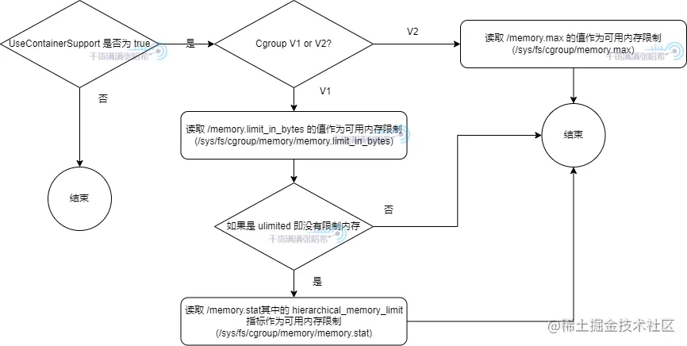

> 本文参考张哥 -> 全网最硬核 JVM 内存解析
- [Java 堆内存大小的确认](https://juejin.cn/post/7225874698906615864)
- [压缩对象指针相关机制](https://juejin.cn/post/7225874698906714168)
- [其他 Java 堆内存相关的特殊机制](https://juejin.cn/post/7225879698952470588)

### 通用初始化与扩展流程

--- 

目前最新的 JVM，主要根据三个指标初始化堆以及扩展或缩小堆：
- 最大堆大小
- 最小堆大小
- 初始堆大小

不同的 GC 情况下，初始化以及扩展的流程可能在某些细节不太一样，但是，大体的思路都是：

1. 初始化阶段，`reserve` `最大堆`大小，并且 `commit` `初始堆`大小
2. 在某些 GC 的某些阶段，根据上次 GC 的数据，动态扩展或者缩小堆大小，扩展就是 commit 更多，缩小就是 uncommit 一部分内存。但是，堆大小不会小于`最小堆大小`，也不会大于`最大堆大小`

### 直接指定三个指标(MinHeapSize,MaxHeapSize,InitialHeapSize)的方式

---

这三个指标，直接对应的 JVM 参数是：

- **最大堆大小**：`MaxHeapSize`，如果没有指定的话会有默认**预设值**用于指导 JVM 计算这些指标的大小，`预设值为 125MB 左右`（96M*13/10）
- **最小堆大小**：`MinHeapSize`，默认为 0，0 代表让 JVM 自己计算
- **初始堆大小**：`InitialHeapSize`，默认为 0，0 代表让 JVM 自己计算

[对应源码](https://github.com/openjdk/jdk/blob/jdk-21+3/src/hotspot/share/gc/shared/gc_globals.hpp)

```cpp
#define ScaleForWordSize(x) align_down((x) * 13 / 10, HeapWordSize)

product(size_t, MaxHeapSize, ScaleForWordSize(96*M),                \
  "Maximum heap size (in bytes)")                                   \
  constraint(MaxHeapSizeConstraintFunc,AfterErgo)                   \
product(size_t, MinHeapSize, 0,                                     \
  "Minimum heap size (in bytes); zero means use ergonomics")        \
  constraint(MinHeapSizeConstraintFunc,AfterErgo)                   \
product(size_t, InitialHeapSize, 0,                                 \
  "Initial heap size (in bytes); zero means use ergonomics")        \
  constraint(InitialHeapSizeConstraintFunc,AfterErgo)               \
```

我们可以通过类似于 `-XX:MaxHeapSize=1G` 这种启动参数对这三个指标进行设置，但是，我们经常看到的可能是 `Xmx` 以及 `Xms` 这两个参数设置这三个指标，这两个参数分别对应：

- `Xmx`：对应 **最大堆大小** 等价于 `MaxHeapSize`
- `Xms`: 相当于同时设置**最小堆大小** `MinHeapSize` 和**初始堆大小** `InitialHeapSize`

[对应JVM源码](https://github.com/openjdk/jdk/blob/jdk-21+3/src/hotspot/share/runtime/arguments.cpp)

```cpp
//如果设置了 Xms
else if (match_option(option, "-Xms", &tail)) {
  julong size = 0;
  //解析 Xms 大小
  ArgsRange errcode = parse_memory_size(tail, &size, 0);
  if (errcode != arg_in_range) {
    jio_fprintf(defaultStream::error_stream(),
                "Invalid initial heap size: %s\n", option->optionString);
    describe_range_error(errcode);
    return JNI_EINVAL;
  }
  //将解析的值设置到 MinHeapSize
  if (FLAG_SET_CMDLINE(MinHeapSize, (size_t)size) != JVMFlag::SUCCESS) {
    return JNI_EINVAL;
  }
  //将解析的值设置到 InitialHeapSize
  if (FLAG_SET_CMDLINE(InitialHeapSize, (size_t)size) != JVMFlag::SUCCESS) {
    return JNI_EINVAL;
  }
//如果设置了 Xmx
} else if (match_option(option, "-Xmx", &tail) || match_option(option, "-XX:MaxHeapSize=", &tail)) {
  julong long_max_heap_size = 0;
  //解析 Xmx 大小
  ArgsRange errcode = parse_memory_size(tail, &long_max_heap_size, 1);
  if (errcode != arg_in_range) {
    jio_fprintf(defaultStream::error_stream(),
                "Invalid maximum heap size: %s\n", option->optionString);
    describe_range_error(errcode);
    return JNI_EINVAL;
  }
  //将解析的值设置到 MaxHeapSize
  if (FLAG_SET_CMDLINE(MaxHeapSize, (size_t)long_max_heap_size) != JVMFlag::SUCCESS) {
    return JNI_EINVAL;
  }
}

```

### 不手动指定三个指标的情况下，这三个指标(MinHeapSize,MaxHeapSize,InitialHeapSize)是如何计算的

--- 

JVM 会读取 **JVM 可用内存**：首先 JVM 需要知道自己可用多少内存，我们称为可用内存。由此引入第一个 JVM 参数，`MaxRAM`，这个参数是用来明确指定 JVM 进程可用内存大小的，如果没有指定，JVM 会自己读取系统可用内存。这个可用内存用来指导 JVM 限制最大堆内存。后面我们会看到很多 JVM 参数与这个可用内存相关。

前面我们还提到了，就算没有指定 `MaxHeapSize` 或者 `Xmx`，`MaxHeapSize` 也有自己预设的一个参考值。源码中这个预设参考值为 125MB 左右（`96M*13/10`）。但是一般最后不会以这个参考值为准，JVM 初始化的时候会有很复杂的计算计算出合适的值。比如你可以在你的电脑上执行下下面的命令，可以看到类似下面的输出：

```shell
java -XX:+UnlockDiagnosticVMOptions -XX:+PrintFlagsFinal -version|grep MaxHeapSize
   size_t MaxHeapSize                              = 17179869184                               {product} {ergonomic}
   size_t SoftMaxHeapSize                          = 17179869184                            {manageable} {ergonomic}
openjdk version "21.0.4" 2024-07-16 LTS
OpenJDK Runtime Environment Temurin-21.0.4+7 (build 21.0.4+7-LTS)
OpenJDK 64-Bit Server VM Temurin-21.0.4+7 (build 21.0.4+7-LTS, mixed mode)
```

可以看到 `MaxHeapSize` 的大小，以及它的值是通过 `ergonomic` 决定的。也就是非人工指定而是 JVM 自己算出来的。

上面提到的那个 125MB 左右的初始参考值，一般用于 JVM 计算。我们接下来就会分析这个计算流程，首先是最大堆内存 MaxHeapSize 的计算流程：

流程中涉及了以下几个参数，还有一些已经过期的参数，会被转换成未过期的参数：
- `MinRAMPercentage`：注意不要被名字迷惑，这个参数是在可用内存比较小的时候生效，即最大堆内存占用为可用内存的这个参数指定的百分比，默认为 50，即 50%
- `MaxRAMPercentage`：注意不要被名字迷惑，这个参数是在可用内存比较大的时候生效，即最大堆内存占用为可用内存的这个参数指定的百分比，默认为 25，即 25%
- `ErgoHeapSizeLimit`：通过自动计算，计算出的最大堆内存大小不超过这个参数指定的大小，默认为 0 即不限制
- `MinRAMFraction`: 已过期，如果配置了会转化为 `MinRAMPercentage` 换算关系是：`MinRAMPercentage` = 100.0 / `MinRAMFraction`，默认是 2
- `MaxRAMFraction`: 已过期，如果配置了会转化为 `MaxRAMPercentage` 换算关系是：`MaxRAMPercentage` = 100.0 / `MaxRAMFraction`，默认是 4

[对应源码](https://github.com/openjdk/jdk/blob/jdk-21+3/src/hotspot/share/gc/shared/gc_globals.hpp)

```cpp
product(double, MinRAMPercentage, 50.0,                             \
  "Minimum percentage of real memory used for maximum heap"         \
  "size on systems with small physical memory size")                \
  range(0.0, 100.0)                                                 \
product(double, MaxRAMPercentage, 25.0,                             \
  "Maximum percentage of real memory used for maximum heap size")   \
  range(0.0, 100.0)                                                 \
product(size_t, ErgoHeapSizeLimit, 0,                               \
  "Maximum ergonomically set heap size (in bytes); zero means use " \
  "MaxRAM * MaxRAMPercentage / 100")                                \
  range(0, max_uintx)                                               \
product(uintx, MinRAMFraction, 2,                                   \
  "Minimum fraction (1/n) of real memory used for maximum heap "    \
  "size on systems with small physical memory size. "               \
  "Deprecated, use MinRAMPercentage instead")                       \
  range(1, max_uintx)                                               \
product(uintx, MaxRAMFraction, 4,                                   \
  "Maximum fraction (1/n) of real memory used for maximum heap "    \
  "size. "                                                          \
  "Deprecated, use MaxRAMPercentage instead")                       \
  range(1, max_uintx)                                               \
```

然后如果我们也没有设置 `MinHeapSize` 以及 `InitialHeapSize`，也会经过下面的计算过程计算出来：


流程中涉及了以下几个参数，还有一些已经过期的参数，会被转换成未过期的参数：
- `NewSize`：初始新生代大小，预设值为 1.3MB 左右（1*13/10）
- `OldSize`：老年代大小，预设值为 5.2 MB 左右（4*13/10）
- `InitialRAMPercentage`：初始堆内存为可用内存的这个参数指定的百分比，默认为 1.5625，即 1.5625%
- `InitialRAMFraction`: 已过期，如果配置了会转化为 `InitialRAMPercentage` 换算关系是：`InitialRAMPercentage` = 100.0 / `InitialRAMFraction`

[对应源码](https://github.com/openjdk/jdk/blob/jdk-21+3/src/hotspot/share/gc/shared/gc_globals.hpp)

```cpp
product(size_t, NewSize, ScaleForWordSize(1*M),                     \
  "Initial new generation size (in bytes)")                         \
  constraint(NewSizeConstraintFunc,AfterErgo)                       \
product(size_t, OldSize, ScaleForWordSize(4*M),                     \
  "Initial tenured generation size (in bytes)")                     \
  range(0, max_uintx)                                               \
product(double, InitialRAMPercentage, 1.5625,                       \
  "Percentage of real memory used for initial heap size")           \
  range(0.0, 100.0)                                                 \
product(uintx, InitialRAMFraction, 64,                              \
  "Fraction (1/n) of real memory used for initial heap size. "      \
  "Deprecated, use InitialRAMPercentage instead")                   \
  range(1, max_uintx)                                               \
```

### 压缩对象指针相关机制 - UseCompressedOops

---

#### 压缩对象指针存在的意义
现代机器大部分是 64 位的，JVM 也从 `9` 开始仅提供 64 位的虚拟机。在 JVM 中，一个对象指针，对应进程存储这个对象的虚拟内存的起始位置，也是 64 位大小：

我们知道，对于 32 位寻址，最大仅支持 4GB 内存的寻址，这在现在的 JVM 很可能不够用，可能仅仅堆大小就超过 4GB。所以目前对象指针一般是 `64` 位大小来支持大内存。但是，这相对 32 位指针寻址来说，`性能上却有衰减`。我们知道，`CPU 仅能处理寄存器里面的数据`，寄存器与内存之间，有很多层 CPU 缓存，虽然内存越来越便宜也越来越大，但是 `CPU 缓存并没有变大`，这就导致如果使用 64 位的指针寻址，相对于之前 32 位的，`CPU 缓存能容纳的指针个数小了一倍`。

Java 是面向对象的语言，JVM 中最多的操作，就是对对象的操作，比如 load 一个对象的字段，store 一个对象的字段，`这些都离不开访问对象指针`。所以 JVM 想尽可能的优化对象指针，这就引入了`压缩对象指针`，让对象指针在条件满足的情况下保持原来的 32 位。

对于 32 位的指针，假设`每一个 1 代表 1 字节`（就是每一位数指向一个字节），那么可以描述 0~2^32-1 这 2^32 字节也就是 `4 GB`（2^10=1024=1KB 2^20=1024*1024=1MB 2^30=1024*1024*1024=1GB） 的虚拟内存。


如果我让`每一个 1 代表 8 字节`呢？也就是让`这块虚拟内存是 8 字节对齐`，也就是我在使用这块内存时候，`最小的分配单元就是 8 字节`。对于 Java 堆内存，也就是一个对象占用的空间，`必须是 8 字节的整数倍`，不足的话会填充到 8 字节的整数倍用于保证对齐。这样最多可以描述 2^32 * 8 字节也就是 32 GB 的虚拟内存。


这就是`压缩指针`的原理，上面提到的相关 JVM 参数是：`ObjectAlignmentInBytes`，这个 JVM 参数表示 `Java 堆中的每个对象，需要按照几字节对齐`，也就是堆按照几字节对齐，值范围是 8 ~ 256，必须是 2 的 n 次方，因为 2 的 n 次方能简化很多运算，例如对于 2 的 n 次方取余数就可以简化成对于 2 的 n 次方减一取与运算，乘法和除法可以简化移位。

如果配置最大堆内存超过 32 GB（当 JVM 是 8 字节对齐），那么压缩指针会失效（其实不是超过 32GB，会略小于 32GB 的时候就会失效，还有其他的因素影响，下一节会讲到）。 但是，这个 32 GB 是和字节对齐大小相关的，也就是 `-XX:ObjectAlignmentInBytes=8` 配置的大小(默认为8字节，也就是 Java 默认是 8 字节对齐)。如果你配置 `-XX:ObjectAlignmentInBytes=16`，那么最大堆内存超过 64 GB 压缩指针才会失效，如果你配置 `-XX:ObjectAlignmentInBytes=32`，那么最大堆内存超过 128 GB 压缩指针才会失效.

#### 压缩对象指针与压缩类指针的关系演进

老版本中， `UseCompressedClassPointers` 取决于 `UseCompressedOops`，即压缩对象指针如果没开启，那么压缩类指针也无法开启。但是从 **Java 15 Build 23** 开始， `UseCompressedClassPointers` 已经不再依赖 `UseCompressedOops` 了，两者在大部分情况下已经独立开来。除非在 x86 的 CPU 上面启用 JVM Compiler Interface（例如使用 GraalVM）。参考 [JDK ISSUE](https://link.juejin.cn/?target=https%3A%2F%2Fbugs.openjdk.java.net%2Fbrowse%2FJDK-8241825)

#### 压缩对象指针的不同模式与寻址优化机制
JVM 需要从虚拟内存的某一点开始申请内存，并且，需要预留出足够多的空间，给可能的一些系统调用机制使用，比如前面我们 native memory tracking 中看到的一些 malloc 内存，其实某些就在这个预留空间中分配的。`JVM会首先确保在操作系统提供的内存空间中分配足够的内存给Java堆`，在确保Java堆内存需求后，JVM才会考虑为元空间、代码缓存等分配内存。

JVM 在 `Reserve` 分配 Java 堆空间的时候，会一下子 Reserve `最大 Java 堆空间的大小`，然后在此基础上 Reserve 分配其他的存储空间。之后分配 Java 对象，在 Reserve 的 Java 堆内存空间内 `Commit` 然后`写入数据映射物理内存`分配 Java 对象。根据前面说的 Java 堆大小的伸缩策略，决定继续 Commit 占用更多物理内存还是 UnCommit 释放物理内存：


Java 是一个面向对象的语言，JVM 中执行最多的就是访问这些对象，`在 JVM 的各种机制中，必须无时无刻考虑怎么优化访问这些对象的速度`，对于压缩对象指针，JVM 就考虑了很多优化。如果我们要使用压缩对象指针，那么需要将这个 64 位的地址，转换为 32 位的地址。然后在读取压缩对象指针所指向的对象信息的时候，需要将这个 32 位的地址，解析为 64 位的地址之后寻址读取。这个转换公式，如下所示：
1. `64 位地址 = 基址 + （压缩对象指针 << 对象对齐偏移）`
2. `压缩对象指针 = (64 位地址 - 基址) >> 对象对齐偏移`

基址其实就是对象地址的开始，注意，`这个基址不一定是 Java 堆的开始地址`，我们后面就会看到。对象对齐偏移与前面提到的 `ObjectAlignmentInBytes` 相关，例如 `ObjectAlignmentInBytes=8` 的情况下，对象对齐偏移就是 3 （因为 8 是 2 的 3 次方）。我们针对这个公式进行优化：

首先，我们考虑把`基址和对象对齐偏移`去掉，那么压缩对象指针可以直接作为对象地址使用。什么情况下可以这样呢？那么就是对象地址从 0 开始算，并且`最大堆内存 + Java 堆起始位置不大于 4GB`。因为这种情况下，Java 堆中对象的最大地址不会超过 4GB，那么压缩对象指针的范围可以直接表示所有 Java 堆中的对象。可以直接使用压缩对象指针作为对象实际内存地址使用。这里为啥是最大堆内存 + Java 堆起始位置不大于 4GB？因为前面的分析，我们知道进程可以申请的空间，是原生堆空间。所以，Java 堆起始位置，肯定不会从 `0x0000 0000 0000 0000` 开始。


如果最大堆内存 + Java 堆起始位置大于 4GB，第一种优化就不能用了，`对象地址偏移就无法避免了`。但是如果可以保证`最大堆内存 + Java 堆起始位置小于 32位 * ObjectAlignmentInBytes`，默认 `ObjectAlignmentInBytes=8` 的情况即 32GB，我们还是可以让基址等于 0（因为最大对象内存大小也不会超过32GB，所以相当于对象可以从0开始），这样 `64 位地址 = （压缩对象指针 << 对象对齐偏移）`


但是，在`ObjectAlignmentInBytes=8` 的情况，如果最大堆内存太大，接近 32GB，想要保证最大堆内存 + Java 堆起始位置小于 32GB，那么 Java 堆起始位置其实就快接近 0 了，这显然不行。所以在最大堆内存接近 32GB 的时候，上面第二种优化也就失效了。但是我们可以让 Java 堆从一个与 `32GB 地址完全不相交的地址`开始（因为如果地址在32GB之内，由于系统需要一些虚拟内存，所以堆占用的内存肯定就小于32GB了，如果从完全不想交的地址开始，那么整个32GB都能用作堆内存，这样就不需要使用基址相加，而是取或即可），这样加法就可以优化为取或运算，即`64 位地址 = 基址 |（压缩对象指针 << 对象对齐偏移）`


最后，在`ObjectAlignmentInBytes=8` 的情况，如果用户通过 `HeapBaseMinAddress` 自己指定了 Java 堆开始的地址，并且与 32GB 地址相交，并最大堆内存 + Java 堆起始位置大于 32GB，但是最大堆内存没有超过 32GB，那么就无法优化了，只能 `64 位地址 = 基址 + （压缩对象指针 << 对象对齐偏移）`


总结下，上面我们说的那四种模式，对应 JVM 中的压缩对象指针的四种模式（以下叙述基于 `ObjectAlignmentInBytes=8` 的情况，即默认情况）：

1. `32-bit` 压缩指针模式：最大堆内存 + Java 堆起始位置不大于 4GB（并且 Java 堆起始位置不能太小），`64 位地址 = 压缩对象指针`
2. `Zero based` 压缩指针模式：最大堆内存 + Java 堆起始位置不大于 32GB（并且 Java 堆起始位置不能太小），`64 位地址 = （压缩对象指针 << 对象对齐偏移）`
3. `Non-zero disjoint` 压缩指针模式：`最大堆内存不大于 32GB`，由于要保证 Java 堆起始位置不能太小，最大堆内存 + Java 堆起始位置大于 32GB，`64 位地址 = 基址 |（压缩对象指针 << 对象对齐偏移）`
4. `Non-zero based` 压缩指针模式：用户通过 `HeapBaseMinAddress` 自己指定了 Java 堆开始的地址，并且与 32GB 地址相交，并最大堆内存 + Java 堆起始位置大于 32GB，但是`最大堆内存没有超过 32GB`，`64 位地址 = 基址 + （压缩对象指针 << 对象对齐偏移）`

### 为何预留第 0 页，压缩对象指针 null 判断擦除的实现

---

前面我们知道，JVM 中的压缩对象指针有四种模式。对于地址非从 0 开始的那两种，即 `Non-zero disjoint` 和 `Non-zero based` 这两种，堆的实际地址并不是从 `HeapBaseMinAddress` 开始，而是有一页预留下来，被称为第 0 页，这一页不映射实际内存，如果访问这一页内部的地址，会有 Segment Fault 异常。那么为什么要预留这一页呢？主要是为了 null 判断优化，实现 null 判断擦除。

要预留第 0 页，不映射内存，实际就是为了让对于基址进行访问可以触发 `Segment Fault`，JVM 会捕捉这个信号，查看触发这个信号的内存地址是否属于第一页，如果属于那么 JVM 就知道了这个是对象为 null 导致的。不过从前面看，我们其实只是为了不映射基址对应的地址，那为啥要保留一整页呢？这个是处于内存对齐与寻址访问速度的考量，里面映射物理内存都是以页为单位操作的，所以内存需要按页对齐。

### 结合压缩对象指针与前面提到的堆内存限制的初始化的关系

---

前面我们说明了不手动指定三个指标的情况下，这三个指标 (MinHeapSize,MaxHeapSize,InitialHeapSize) 是如何计算的，但是没有涉及压缩对象指针。如果压缩对象指针开启，那么堆内存限制的初始化之后，会根据参数确定压缩对象指针是否开启：

1. 首先，确定 Java 堆的起始位置：
   1. 第一步，在不同操作系统不同 CPU 环境下，`HeapBaseMinAddress` 的默认值不同，大部分环境下是 `2GB`
   2. 将 `DefaultHeapBaseMinAddress` 设置为 `HeapBaseMinAddress` 的默认值，即 `2GB`
   3. 如果用户在启动参数中指定了 `HeapBaseMinAddress`，如果 `HeapBaseMinAddress` 小于 `DefaultHeapBaseMinAddress`，将 `HeapBaseMinAddress` 设置为 `DefaultHeapBaseMinAddress`
2. 计算压缩对象指针堆的最大堆大小:
   1. 读取对象对齐大小 `ObjectAlignmentInBytes` 参数的值，默认为 8
   2. 对 `ObjectAlignmentInBytes` 取 2 的对数，记为 `LogMinObjAlignmentInBytes`
   3. 将 32 位左移 `LogMinObjAlignmentInBytes` 得到 `OopEncodingHeapMax` 即不考虑预留区的最大堆大小
   4. 如果需要预留区，即 `Non-Zero Based Disjoint` 以及 `Non-Zero Based` 这两种模式下，需要刨除掉预留区即第 0 页的大小，即 `OopEncodingHeapMax` - 第 0 页的大小
3. 读取当前 JVM 配置的最大堆大小
4. 如果 JVM 配置的最大堆小于压缩对象指针堆的最大堆大小，并且没有通过 JVM 启动参数明确关闭压缩对象指针，则开启压缩对象指针。否则，关闭压缩对象指针
5. 如果压缩对象指针关闭，根据前面分析过的是否压缩类指针强依赖压缩对象指针，如果是，关闭压缩类指针

### 各种压缩指针模式的开启

---

#### 32-bit 压缩指针模式
> 最大堆内存 + Java 堆起始位置不大于 4GB（并且 Java 堆起始位置不能太小），`64 位地址 = 压缩对象指针`

从上一节能看出来，`HeapBaseMinAddress` 在不设置时默认是 `2GB`（大部分环境下）:
1. `maxHeapSize` < `4GB` - `HeapBaseMinAddress` 
2. eg: -Xmx32M
3. `Java 堆会从界限减去最大堆大小的位置开始 reserve`，也就是在 `-Xmx32M` 下，堆的起始位置是 `0x0000 0000 fe00 0000` （0x0000 0000 fe00 0000 + 32M = 4GB）

#### Zero based 压缩指针模式
> 最大堆内存 + Java 堆起始位置不大于 32GB（并且 Java 堆起始位置不能太小），64 位地址 = （压缩对象指针 << 对象对齐偏移）

从上一节能看出来，`HeapBaseMinAddress` 在不设置时默认是 `2GB`（大部分环境下）:
1. `maxHeapSize` > `4GB` - `HeapBaseMinAddress` 
2. `maxHeapSize` < `32GB` - `HeapBaseMinAddress` 
3. eg: -Xmx2050M

#### Non-zero disjoint 压缩指针模式
> 最大堆内存不大于 32GB，由于要保证 Java 堆起始位置不能太小，最大堆内存 + Java 堆起始位置大于 32GB，64 位地址 = 基址 |（压缩对象指针 << 对象对齐偏移）

从上一节能看出来，`HeapBaseMinAddress` 在不设置时默认是 `2GB`（大部分环境下）:
1. java 堆起始位置与32GB完全不相交的地址(0x0000001000000000(64GB))，32GB地址=0x0000000800000000
2. -Xmx31G

#### Non-zero based 压缩指针模式
> 用户通过 HeapBaseMinAddress 自己指定了 Java 堆开始的地址，并且与 32GB 地址相交，并最大堆内存 + Java 堆起始位置大于 32GB，但是最大堆内存没有超过 32GB，64 位地址 = 基址 + （压缩对象指针 << 对象对齐偏移）

从上一节能看出来，`HeapBaseMinAddress` 在不设置时默认是 `2GB`（大部分环境下）:
1. 自己指定了 Java 堆开始的地址，并且与 32GB 地址相交 `-XX:HeapBaseMinAddress=2G`
2. 最大堆内存 + Java 堆起始位置大于 32GB `-Xmx31G`

### 各模式选择条件总结

--- 

| 模式 | 堆基址条件 | 最大堆限制                                   | 选择逻辑 |
|------|------------|-----------------------------------------|----------|
| 32-bit | 堆空间完全在4GB范围内 | < 4GB - HeapBaseMinAddress              | 适用于堆需求较小的应用 |
| Zero-based | 任意堆基址 | HeapBaseMinAddress + Xmx > 4GB 且 < 32GB | 当堆总大小超过4GB但小于32GB时使用 |
| Non-zero based | ~2GB | <32GB                                   | 平衡系统内存布局需求的通用模式 |
| Non-zero disjoint | `>=32GB` (如64GB) | <32GB                                   | 适用于特定的内存布局需求 |


### 堆大小的动态伸缩

--- 

- `MinHeapFreeRatio`: 目标最小堆空闲比例，如果某次 GC 之后堆的某个区域（在某些 GC 是整个堆）空闲比例小于这个比例，那么就考虑将这个区域扩容。默认是 40，即默认是 `40%`，但是某些 GC 如果你不设置就会变成 0%。0% 代表从来不会因为没有达到目标最小堆空闲比例而扩容，配置为 0% 一般是为了堆的大小稳定。
- `MaxHeapFreeRatio`: 目标最大堆空闲比例，如果某次 GC 之后堆的某个区域（在某些 GC 是整个堆）空闲比例大于这个比例，那么就考虑将这个区域缩小。默认是 70，即默认是 `70%`，但是某些 GC 如果你不设置就会变成 100%。100% 代表从来不会因为没有达到目标最大堆空闲比例而扩容，配置为 100% 一般是为了堆的大小稳定。
- `MinHeapDeltaBytes`: 当扩容时，至少扩展多大的内存。默认是 `166.4 KB`（128*13/10）

#### 上诉几个参数在不同 GC 下的表现
- `SerialGC`: 在 SerialGC 的情况下，`MinHeapFreeRatio` 与 `MaxHeapFreeRatio` 指的仅仅是老年代的目标空闲比例，`仅对老年代生效`。在触发涉及老年代的 GC 的时候（其实就是 FullGC），GC 结束时，会查看当前老年代的空闲比例，与 MinHeapFreeRatio 和 MaxHeapFreeRatio比较 判断是否扩容或者缩小老年代的大小
- `ParallelGC`: 在 ParallelGC 的情况下，`MinHeapFreeRatio` 与 `MaxHeapFreeRatio` 指的是`整个堆`的大小。并且，如果这两个 JVM 参数没有明确指定的话，那么 MinHeapFreeRatio 就是 0，MaxHeapFreeRatio 就是 100（相当于不会根据这两个参数调整堆大小。并且，如果 `UseAdaptiveSizePolicy` 是 false 的话，这两个参数也不会生效。
- `ShenandoahGC`: 这三个参数不生效
- `ZGC`: 这三个参数不生效

### 适用于长期运行并且尽量将所有可用内存被堆使用的 JVM 参数 `AggressiveHeap`

---

`AggressiveHeap` 是一种激进地让 JVM 使用当前系统的`剩余内存`的一种配置，开启会根据系统可用内存，自动设置堆大小等内存参数，将内存的一半分配给堆，另一半留给堆外其他的子系统占用内存，通过强制使用 ParallelGC 这种不会占用太多堆外内存的 GC 算法这种类似的思路限制堆外内存的使用（只能使用这个 GC，你指定其他 GC 的话会启动报错 Error occurred during initialization of VM. Multiple garbage collectors selected）。默认为 false 即不开启，可以通过 -XX:+AggressiveHeap 开启。开启这个参数会强制设置以下参数：

`目标堆大小 = Math.min(系统可用内存/2, 系统可用内存 - 160MB)`

- MaxHeapSize 最大堆内存为目标堆大小
- InitialHeapSize 初始堆内存为目标堆大小
- NewSize 和 MaxNewSize 新生代为目标堆大小 * 八分之三
- BaseFootPrintEstimate 堆外内存占用大小预估为目标堆大小，用于指导一些堆外内存结构的初始化
- UseLargePages 为开启，使用大页内存分配，增加实际物理内存的连续性
- TLABSize 为 256K，即初始 TLAB 大小为 256 K，但是下面我们设置了 ResizeTLAB 为 false，所以 TLAB 就会保持为 256K
- ResizeTLAB 为 false，也就是 TLAB 大小不再随着 GC 以及分配特征的改变而改变，减少没必要的计算，反正进程要长期存在了，就在初始就指定一个比较大的 TLAB 的值。
- UseParallelGC 为 true，强制使用 ParallelGC
- ThresholdTolerance 为最大值 100，ThresholdTolerance 用于动态控制对象晋升到老年代需要存活过的 GC 次数，如果 1 + ThresholdTolerance/100 * MinorGC 时间大于 MajorGC 的时间，我们就认为 MinorGC 占比过大，需要将更多对象晋升到老年代。反之，如果 1 + ThresholdTolerance/100 * MajorGC 时间大于 MinorGC 的时间，就认为 MajorGC 时间占比过多，需要将更少的对象晋升到老年代。调整成 100 可以实现这个晋升界限基本不变保持稳定。
- ScavengeBeforeFullGC 设置为 false，在 FullGC 之前，先尝试执行一次 YoungGC。因为长期运行的应用，会经常 YoungGC 并晋升对象，需要 FullGC 的时候一般 YoungGC 无法回收那么多内存避免 FullGC，关闭它更有利于避免无效扫描弄脏 CPU 缓存。

### JVM 参数 `AlwaysPreTouch` 的作用

---

JVM 申请内存的流程，内存并不是在 `JVM commit` 一块内存之后就立刻被操作系统分配实际的物理内存的，只有真正往里面写数据的时候，才会关联实际的物理内存。所以对于 JVM 堆内存，我们也可以推测出，堆内存随着对象的分配才会关联实际的物理内存。那我们有没有办法`提前强制`让 committed 的内存关联实际的物理内存呢？很简单，往这些 committed 的内存中写入假数据就行了（一般是填充 0）。

对于不同的 GC，由于不同 GC 对于堆内存的设计不同，所以对于 AlwaysPreTouch 的处理也略有不同，在以后的系列我们详细解析每一种 GC 的时候，会详细分析每种 GC 的堆内存设计，这里我们就简单列举通用的 AlwaysPreTouch 处理。AlwaysPreTouch 打开后，所有新 commit 的堆内存，都会往里面填充 0，相当于写入空数据让 commit 的内存真正被分配。


### JVM 参数 `UseContainerSupport` - JVM 如何感知到容器内存限制

---

让 JVM 感知容器环境的相关 JVM 参数是 `UseContainerSupport`，默认值为 true，这个配置默认开启，在开启的情况下，JVM 会通过下面的流程读取内存限制：



### `SoftMaxHeapSize` - 用于平滑迁移更耗内存的 GC 使用

---

由于那种完并发的 GC（目标是完全无 Stop the world 暂停或者是亚毫秒暂停的 GC），例如 ZGC ，需要在堆外使用比 G1GC 以及 ParallelGC 多的多的空间（指的就是我们后面会分析到的 Native Memory Tracking 的 GC 部分占用的内存），并且由于 ZGC 这种目前是未分代的（Java 20 之后会引入分代 ZGC），导致 GC 在堆外占用的内存会更多。所以我们一般认为，在从 G1GC，或者 ParallelGC 切换到 ZGC  的时候，就算最大堆大小等各种 JVM 参数不变，JVM 也会需要更多的物理内存。但是，在实际的生产中，修改 JVM GC 是比较简单的，修改下启动参数就行了，但是给 JVM 加内存是比较困难的，因为是实际要消耗的资源。如果不修改 JVM 内存限制参数，也不加可用内存，线上可能会在换 GC 后经常出现被 OOMkiller 干掉的情况。

为了能让大家更平滑的切换 GC，以及对于线上应用，我们可能实际不一定需要用原来配置的堆大小的空间，JVM 针对 ShenandoahGC 以及 ZGC 引入了 `SoftMaxHeapSize` 这个参数（目前这个参数只对于这种专注于避免全局暂停的 GC 生效）。这个参数虽然默认是 0，但是如果没有指定的话，会自动设置为前文提到的 MaxHeapSize 大小。

ZGC 与 ShenandoahGC 的堆设计，都有软最大大小限制的概念。这个软最大大小是随着时间与 GC 表现（例如分配速率，空闲率等）不断变化的，这两个 GC 会在堆扩展到软最大大小之后，尽量就不扩展堆大小，尽量通过激进的 GC 回收空间。只有在暂停世界都完全无法回收足够内存用以分配的时候，才会尝试扩展，这之后最大限制就到了 MaxHeapSize。SoftMaxHeapSize 会给这个软最大大小一个指导值，让软最大大小不要超过这个值。

