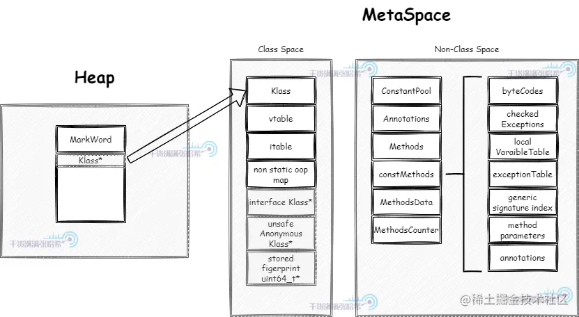
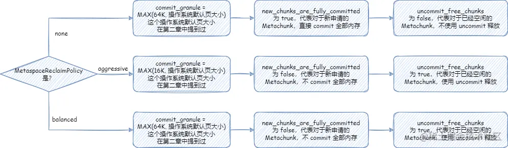
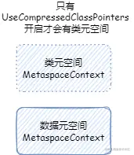
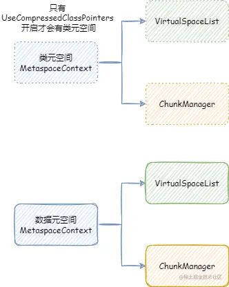
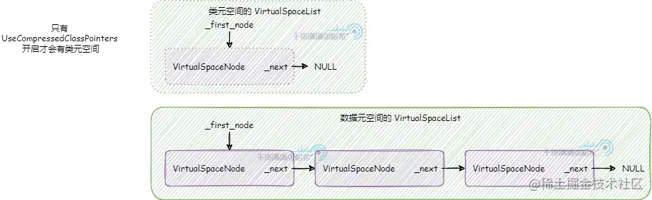
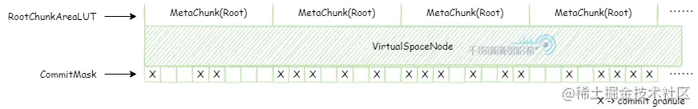
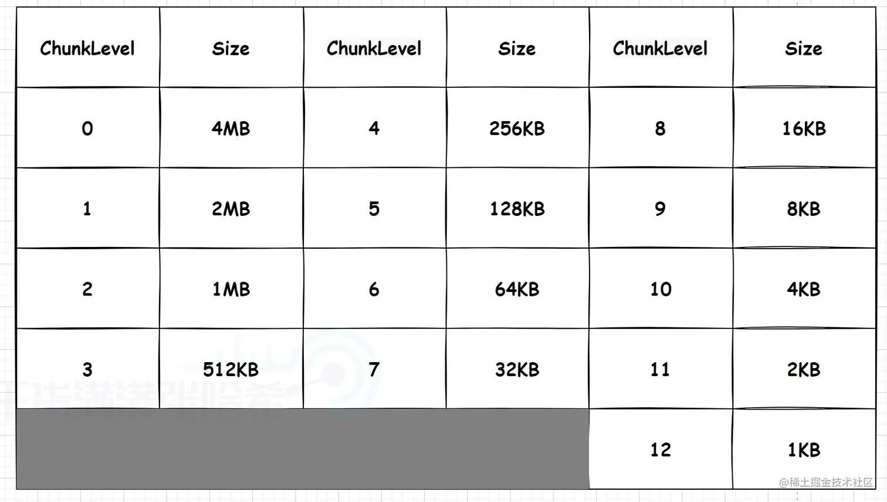
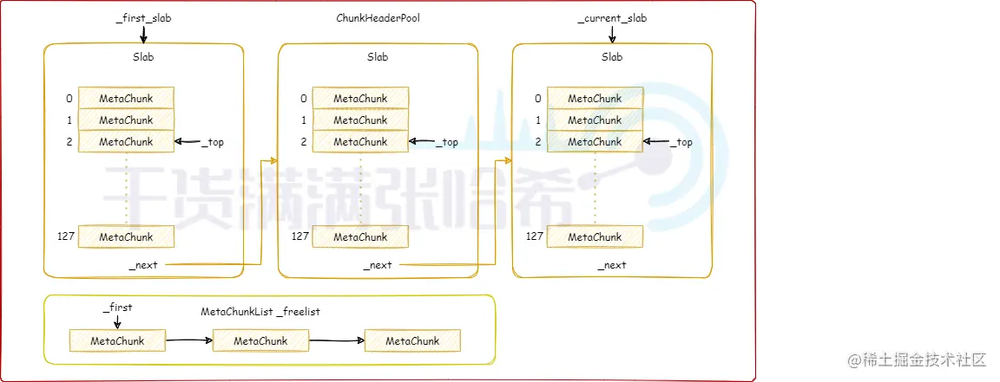

> 本文参考张哥 -> 全网最硬核 JVM 内存解析
- [元空间存储的元数据](https://juejin.cn/post/7225879698952486972)
- [元空间的核心概念与设计](https://juejin.cn/post/7225879724545835045)

## 什么是元数据，为什么需要元数据

---

JVM 在执行 Java 应用程序时，将加载的 Java 类的许多细节记录在内存中，这些信息称为类`元数据（Class MetaData）`。这些元数据对于 Java 的很多灵活的语言以及虚拟机特性都是很重要的，比如动态类加载、JIT 实时编译、反射以及动态代理等等。不同的 JVM 加载类保存的内存信息是不一样的，它们通常`在更低的内存占用`与`更快的执行速度之间进行权衡`（类似于空间还是时间的权衡）。对于 OpenJDK Hotspot 使用的则是相对丰富的元数据模型来获得尽可能快的性能（时间优先，不影响速度的情况下尽量优化空间占用）。相比于 C,C++,Go 这些离线编译为可执行二进制文件的程序相比，像 JVM 这样的托管运行时动态解释执行或者编译执行的，`则需要保留更多关于正在执行的代码的运行时信息`。原因如下：

1. `依赖类库并不是一个确定的有限集`: Java 可以动态加载类，并且还有 ASM 以及 Javassist 这些工具在运行时动态定义类并加载，还有 JVMTI agent 这样的机制来动态修改类。所以，JVM 通过类元数据保存：`运行时中存在哪些类，它们包含哪些方法和字段，并能够在链接加载期间动态地解析从一个类到另一个类的引用`。类的链接也需要考虑类的`可见性和可访问性`。类元数据`与类加载器相关联`，同时类元数据也包括`类权限和包路径以及模块信息`（Java 9之后引入的模块化），以确定可访问性
2. `JVM 解释执行或者通过 JIT 实时编译执行 Java 代码的时候需要基于类元数据的很多信息才能执行`：需要知道例如类与类之间的关系，类属性以及字段还有方法结构等等等等。例如在做强制转换的时候，需要检查类型的父子类关系确定是否可以强制转换等等。
3. `JVM 需要一些统计数据决定哪些代码解释执行那些代码是热点代码需要 JIT 即时编译执行`。
4. `Java 有反射 API 供用户使用`，这就需要运行时知道所有类的各种信息。

## 什么时候用到元空间，元空间保存什么

---

### 什么时候用到元空间，以及释放时机

`只要发生类加载，就会用到元空间`。例如我们创建一个类对象时：这个类首先会被类加载器加载，在发生类加载的时候，对应类的元数据被存入元空间。元数据分为`两部分存入元空间`，`一部分存入了元空间的类空间另一部分存入了元空间的非类空间`。堆中新建的对象的对象头中的 `Klass` 指针部分，指向元空间中 Klass，同时，Klass 中各种字段都是指针，实际对象的地址，可能在非类空间，例如实现方法多态以及 virtual call 的 vtable 与 itable 保存着方法代码地址的引用指针。非类空间中存储着比较大的元数据，例如常量池，字节码，JIT 编译后的代码等等。由于编译后的代码可能非常大，以及 JVM 对于多语言支持的扩展可能动态加载很多类，所以`将 MetaSpace 的类空间与非类空间区分开`。如图所示：



JVM 启动参数 `-XX:CompressedClassSpaceSize` 指定的是压缩类空间大小，默认是 `1G`。`-XX:MaxMetaspaceSize` 控制的是 MetaSpace 的总大小。

当类加载器加载的所有类都没有任何实例，并且没有任何指向这些类对象(java.lang.Class)的引用，也没有指向这个类加载器的引用的时候，如果发生了 GC，这个类加载器使用的元空间就会被释放。但是这个释放并不一定是释放回操作系统，而是被标记为可以被其他类加载器使用了。

### 元空间保存什么

元空间保存的数据，目前分为两大类：

- `Java 类数据`: 即加载的 Java 类对应 JVM 中的 Klass 对象（Klass 是 JVM 源码中的一个 c++ 类，你可以理解为类在 JVM 中的内存形式），但是这个 Klass 对象中存储的很多数据都是指针，具体的数据存储属于非 Java 类数据，一般非 Java 类数据远比 Java 类数据占用空间大。
- `非 Java 类数据`: 即被 Klass 对象引用的一些数据，例如：类中的各种方法，注解，执行采集与统计信息等等。

如果是 64 位的 JVM 虚拟机（从 Java 9+ 开始只有 64 位的虚拟机了）并且开启了压缩类指针(`-XX:+UseCompressedClassPointers`，默认是开启的)，那么元空间会被划分成两部分：

- `类元空间`：存储上面说的Java 类数据的空间
- `数据元空间`：存储上面说的非 Java 类数据的空间

基于是否开启了压缩类指针分为这两部分的原因是，在对象头需要保留指向 `Klass` 的指针，如果我们能尽量压缩这个指针的大小，那么每个对象的大小也能得到压缩，这将节省很多堆空间。在 64 位虚拟机上面，指针默认都是 64 位大小的，开启压缩类指针(`-XX:+UseCompressedClassPointers`，默认是开启的)之后，类指针变为 32 位大小，最多能指向 2^32 也就是 4G 的空间，如果我们能保持 Klass 所处的空间占用不超过这个限制的话，就能使用压缩类指针了。所以我们把 Klass 单独提取到一个单独的区域进行分配。Klass 占用的空间并不会太大，虽然对于 Java 中的每一个类都会有一个 Klass，但是占用空间的方法内容以及动态编译信息等等，具体数据都在`数据元空间`中存储，Klass 中大部分都是指针。基本上很少会遇到 32 位指针不够用的情况。

注意，老版本中， `UseCompressedClassPointers` 取决于 `UseCompressedOops`，即压缩对象指针如果没开启，那么压缩类指针也无法开启。但是从 Java 15 Build 23 开始， UseCompressedClassPointers 已经不再依赖 UseCompressedOops 了，两者在大部分情况下已经独立开来。除非在 x86 的 CPU 上面启用 JVM Compiler Interface（例如使用 GraalVM）。

在元空间分配的对象，都是调用 `Metaspace::allocate` 从元空间分配空间。调用这个方法的是 `MetaspaceObj` 的构造函数，对应源码：https://github.com/openjdk/jdk/blob/jdk-21+3/src/hotspot/share/memory/allocation.cpp
```c++
void* MetaspaceObj::operator new(size_t size, ClassLoaderData* loader_data,
                                 size_t word_size,
                                 MetaspaceObj::Type type, TRAPS) throw() {
  // Klass has its own operator new
  return Metaspace::allocate(loader_data, word_size, type, THREAD);
}

void* MetaspaceObj::operator new(size_t size, ClassLoaderData* loader_data,
                                 size_t word_size,
                                 MetaspaceObj::Type type) throw() {
  assert(!Thread::current()->is_Java_thread(), "only allowed by non-Java thread");
  return Metaspace::allocate(loader_data, word_size, type);
}
```

`MetaspaceObj` 的 Operator new 方法定义了从 MetaSpace 上分配内存，即所有 `MetaspaceObj` 的子类，只要没有明确覆盖从其他地方分配，就会从 MetaSpace 分配内存。`MetaspaceObj` 的子类包括：

`位于类元空间的`：

- `Klass`: 其实就是 Java 类的实例（每个 Java 的 class 有一个对应的对象实例，用来反射访问，这个就是那个对象实例），即 Java 对象头的类型指针指向的实例：
  - `InstanceKlass`：普通对象类的 Klass：
    - `InstanceRefKlass`：`java.lang.ref.Reference` 类以及子类对应的 Klass
    - `InstanceClassLoaderKlass`：Java 类加载器对应的 Klass
    - `InstanceMirrorKlass`：java.lang.Class 对应的 Klass
  - `ArrayKlass`：Java 数组对应的 Klass
    - `ObjArrayKlass`：普通对象数组对应的 Klass
    - `TypeArrayKlass`：原始类型数组对应的 Klass

`位于数据元空间的`：

- `Symbol`：符号常量，即类中所有的符号字符串，例如类名称，方法名称，方法定义等等。
- `ConstantPool`：运行时常量池，数据来自于类文件中的常量池。
- `ConstanPoolCache`：运行时常量池缓存，用于加速常量池访问
- `ConstMethod`：类文件中的方法解析后，静态信息放入 ConstMethod，这部分信息可以理解为是不变的，例如字节码，行号，方法异常表，本地变量表，参数表等等。
- `MethodCounters`：方法的计数器相关数据。
- `MethodData`：方法数据采集，动态编译相关数据。例如某个方法需要采集一些指标，决定是否采用 C1 C2 动态编译优化性能。
- `Method`：Java 方法，包含以上 `ConstMethod`，`MethodCounters`，`MethodData` 的指针以及一些额外数据。
- `RecordComponent`：对应 Java 14 新特性 Record，即从 Record 中解析出的关键信息。

## 元空间的核心概念与设计

---

### 元空间的整体配置以及相关参数

- `MetaspaceSize`：初始元空间大小，也是最小元空间大小。后面元空间大小伸缩的时候，不会小于这个大小。默认是 21M。
- `MaxMetaspaceSize`：最大元空间大小，默认是无符号 int 最大值。
- `MinMetaspaceExpansion`：每次元空间大小伸缩的时候，至少改变的大小。默认是 256K。
- `MaxMetaspaceExpansion`: 每次元空间大小伸缩的时候，最多改变的大小。默认是 4M。
- `MaxMetaspaceFreeRatio`：最大元空间空闲比例，默认是 70，即 70%。
- `MinMetaspaceFreeRatio`：最小元空间空闲比例，默认是 40，即 40%。
- `UseCompressedClassPointers`：前文提到过，是否开启压缩类指针。默认是开启的。老版本中， UseCompressedClassPointers 取决于 UseCompressedOops，即压缩对象指针如果没开启，那么压缩类指针也无法开启。但是从 Java 15 Build 23 开始， UseCompressedClassPointers 已经不再依赖 UseCompressedOops 了，两者在大部分情况下已经独立开来。除非在 x86 的 CPU 上面启用 JVM Compiler Interface（例如使用 GraalVM）。
- `CompressedClassSpaceSize`：如果启用了压缩类指针，则元空间会分为类元空间和数据元空间，否则只有数据元空间。这个参数限制类元空间的大小，范围是 1M ~ 3G。默认大小是 1G，如果指定了 `MaxMetaspaceSize`，那么为 1G 与 `MaxMetaspaceSize * 0.8` 中比较小的那个值
- `CompressedClassSpaceBaseAddress`：类元空间起始虚拟内存地址，这个一般不指定。作用和前文分析堆内存的堆起始位置的作用差不多。
- `MetaspaceReclaimPolicy`：可以为：`balanced`, `aggressive`, 以及 `none`，需要注意一点的是 none 要被移除了。默认是 balanced。具体主要是影响元空间底层相关的配置

元空间底层相关的配置包括：

- `commit 粒度 - commit_granule`：通过第二章的分析我们知道，JVM 的空间一般是先 reserve， 之后 commit 之前 reserve 的空间的一部分，然后才能使用的。这个 commit 粒度代表元空间中 commit 内存的最小粒度，元空间在扩容缩容的时候最小的大小单位是 commit 粒度。
- `虚拟内存空间节点内存大小 - virtual_space_node_default_word_size`：这是后文我们会详细分析的 VirtualSpaceNode 的虚拟内存大小。大小在 64 位环境下是 64 MB。
- `虚拟内存空间节点内存对齐 - virtual_space_node_reserve_alignment_words`：这是后文我们会详细分析的 `VirtualSpaceNode` 的虚拟内存大小需要对齐的大小，即整体大小需要大于这个对齐大小并且是这个对齐大小整数倍。这个大小就是 `MetaChunk` 的最大大小，即 4MB。
- `当前 MetaChunk 不足以分配的时候，是否尝试扩容当前 MetaChunk - enlarge_chunks_in_place`：这个参数在正式 JVM 中是 true，并且不能修改。后文我们会详细分析什么是 MetaChunk。这里简单理解就是，元空间整体使用了和 Linux 伙伴分配算法类似的设计与抽象，其中内存分配的单元就是 Chunk，元空间中对应的就是 MetaChunk。
- `分配新的 MetaChunk 的时候，是否一下子 commit MetaChunk 所有的内存 - new_chunks_are_fully_committed`：后文我们会详细分析什么是 MetaChunk。
- `在 MetaChunk 整个空间都没有使用的时候，是否将 MetaChunk 的内存全部释放回操作系统 - uncommit_free_chunks`：后文我们会详细分析什么是 MetaChunk。

从 Java 16 开始，引入了弹性元空间。老的元空间由于设计上分配粒度比较大，并且没有很好地释放空间的策略设计，所以占用可能比较大。Java 16 开始，JEP 387: Elastic Metaspace 引入了`弹性元空间的设计`，也是我们这里要讨论的设计。这个弹性元空间也引入了一个重要的参数 `-XX:MetaspaceReclaimPolicy`。

`MetaspaceReclaimPolicy`：可以为：`balanced`, `aggressive`, 以及 `none`，需要注意一点的是 none 要被移除了，这三个配置具体影响是：



### 元空间上下文 MetaspaceContext

`MetaspaceContext` 本身直接原生堆上面分配，Native Memory Tracking 中属于 Metaspace 那一类别，即元空间的抽象类占用的空间。

JVM 元空间，会在全局建立`两个元空间上下文`（`MetaspaceContext`），一个用于类元空间（我们后面称为`类元空间 MetaspaceContext`），一个用于数据元空间（我们后面称为`数据元空间 MetaspaceContext`）。当然，在没有启用压缩类指针的时候，只会初始化一个数据元空间 `MetaspaceContext`，不会初始化类元空间 `MetaspaceContext`，之后使用分配的时候，也只会用数据元空间 MetaspaceContext 进行分配。但是我们在后面讨论的时候，`只会讨论开启压缩类指针的情况，因为这是默认并且常用的情况`。



每个 `MetaspaceContext` 都会对应`一个独立的` `VirtualSpaceList`，以及一个独立的 `ChunkManager`。



这个 `VirtualSpaceList` 中的每一个元素都是一个 `VirtualSpaceNode`。顾名思义，`VirtualSpaceNode` 是从操作系统申请内存，与元空间内存划分的抽象隔离的中间层抽象。`VirtualSpaceList` 负责与操作系统交互，申请或者释放内存。元空间与 `VirtualSpaceList` 交互，使用内存。

`ChunkManager` 顾名思义，是管理所有 Chunk 的内存管理器。Chunk 这个概念经常出现在各种伙伴内存管理算法框架（Buddy Allocator）中，一般指内存管理分配的最小单元，这里的 Chunk 抽象对应的就是 `MetaChunk`。`ChunkManager` 从 `VirtualSpaceList` 上面获取一块连续比较大的内存的 `MetaChunk`（其实是 `RootMetaChunk`），然后将这个 `RootMetaChunk` 按照分配需求，连续对半分割成需要的大小，返回这个合适大小的 `MetaChunk`，剩下的分割出来的 `MetaChunk` 进入 `FreeChunkListVector` 用于下次分配 `MetaChunk` 的时候，直接返回合适的，就不再从 `VirtualSpaceList` 获取了。

### 虚拟内存空间节点列表 VirtualSpaceList

`VirtualSpaceList` 本身直接原生堆上面分配，Native Memory Tracking 中属于 `Class` 那一类别，即元空间的加载类占用的空间。其实本人感觉这么设计不太合理，应该和 `MetaspaceContext` 属于同一个类别才比较合理。真正分配加载的类的占用空间的是从 `VirtualSpaceNode` 上面标记的内存分配的，这是下一小节要分析的内容。

首先提一点，类元空间 `MetaspaceContext` 与数据元空间 `MetaspaceContext` 略有不同：类元空间 `MetaspaceContext` 的 `VirtualSpaceList` 是不可以扩展申请新的内存的，但是数据元空间 `MetaspaceContext` 的 `VirtualSpaceList` 是可以的。也就是说：类元空间 `MetaspaceContext` 的 `VirtualSpaceList` 其实只有一个 `VirtualSpaceNode`，但是数据元空间 `MetaspaceContext` 的 `VirtualSpaceList` 是一个包含多个 `VirtualSpaceNode` 的列表。



### 虚拟内存空间节点 VirtualSpaceNode 与 CompressedClassSpaceSize

`VirtualSpaceNode` 本身直接原生堆上面分配，Native Memory Tracking 中属于 `Class` 那一类别，即元空间的加载类占用的空间。其实本人感觉这么设计不太合理，应该和 `MetaspaceContext` 属于同一个类别才比较合理。真正分配加载的类的占用空间的是从 `VirtualSpaceNode` 上面标记的内存地址分配的，`VirtualSpaceNode` 本身的空间占用只是起到描述记录作用，应该也属于元空间描述的那一类。

`VirtualSpaceNode` 是一块连续的虚拟内存空间内存的抽象。类元空间的 `VirtualSpaceList` 只包含一个 `VirtualSpaceNode`，大小是前文提到的 `CompressedClassSpaceSize`。

`数据元空间并不像类元空间或者堆内存那样`，一下子 reserve 最大堆内存限制的内存，而是`每次 reserve VirtualSpaceNode 大小`。`VirtualSpaceNode` 大小在 64 位环境下是 64 MB。

`VirtualSpaceNode` 通过两个数据结构来管理它维护的虚拟内存空间：

- `CommitMask`：实际是一个位图，用于维护哪些内存被 commit 了，哪些没有，位图的标记的单位就是前文提到的 commit_granule（commit 粒度）。
- `RootChunkAreaLUT`：用于维护每个 `RootMetaChunk` 的内存分布。

一个 `VirtualSpaceNode` 的主要结构如下图所示：



### MetaChunk

`MetaChunk` 是元空间内存分配的核心抽象，其本质就是`描述`一块连续的虚拟内存空间。`MetaChunk` 本身只是一个描述对象，它也是直接原生堆上面分配，Native Memory Tracking 中属于 `Metaspace` 那一类别，即元空间的抽象类占用的空间。这个描述对象是池化的，参考后面会分析的 `ChunkHeaderPool`。

元空间的任意分配，都是在某个 `MetaChunk` 上进行的。`MetaChunk` 有级别的概念，即 `ChunkLevel`，每个 `MetaChunk` 都有自己的 `ChunkLevel`，这个 `ChunkLevel` 主要代表了 `MetaChunk` 描述的内存空间的大小，每一个 level 都是下一个 level 大小的 2 倍：



从 `VirtualSpaceNode` 上直接划分的 `MetaChunk` 是 `RootMetaChunk`，它的 `ChunkLevel` 为最高级别的 0，大小是 4MB，并且其中的内存只是 reserve 还没有 commit 的。

`MetaChunk`有三个状态：
- `Dead`：即 `MetaChunk` 只是对象被创建出来，但是没有关联描述实际的虚拟内存。后面我们会知道，`MetaChunk` 是池化可回收在利用的，`MetaChunk` 的池就是 `ChunkHeaderPool`。位于 `ChunkHeaderPool` 都还没有关联描述实际的虚拟内存，状态为 `Dead`。
- `Free`：即 `MetaChunk` 关联描述了实际的虚拟内存，但是没有被实际使用。此时，这个 `MetaChunk` 位于 `ChunkManager` 管理。
- `InUse`：即 `MetaChunk` 关联描述了实际的虚拟内存，也被实际使用了，此时，`MetaChunkArena` 管理这个 `MetaChunk` 上面的内存分配。

#### ChunkHeaderPool 池化 MetaChunk 对象

`MetaChunk` 实际上只是一块连续的虚拟内存空间的描述类，即元数据类。由于类加载需要的大小不一，并且还经常会发生合并，切分等等，`MetaChunk` 可能有很多很多，元空间为了节省这个元数据类占用的空间，将其池化，回收再利用。这个池就是 `ChunkHeaderPool`。例如，从 `VirtualSpaceNode` 上直接划分 `RootMetaChunk` 的内存空间，会从 `ChunkHeaderPool` 申请一个 `MetaChunk` 用于描述。当两个 `MetaChunk` 的空间需要合并成一个的时候，其中一个 `MetaChunk` 其实就没有用了，会放回 `ChunkHeaderPool`，而不是直接 `free` 掉这个对象。

`ChunkHeaderPool` 本身直接原生堆上面分配，Native Memory Tracking 中属于 `Metaspace` 那一类别，即元空间的抽象类占用的空间。

其实从这里我们可以推测出，`MetaChunk` 本身也是直接原生堆上面分配，Native Memory Tracking 中也是属于 `Metaspace` 那一类别。

`ChunkHeaderPool` 的结构是：



其实 `ChunkHeaderPool` 的机制很简单：

- 申请 `MetaChunk` 用于描述内存：
  - 首先查看 `_freelist`，是否有之前放回的 `MetaChunk` 可以使用，如果有，就返回那个 `MetaChunk`，并从 `_freelist` 移除这个 `MetaChunk`
  - 如果没有，读取 `_current_slab` 指向的 `Slab`，`Slab` 核心就是一个预分配好的 `MetaChunk` 数组（大小是 128），`_top` 指的是当前使用到数组的哪一个。
  - 如果 `_top` 没有到 128，返回 `_top` 代表的 `MetaChunk`，并将 `_top` 加 1。
  - 如果 `_top` 到 128，创建新的 `Slab`，`_current_slab` 指向这个新的 `Slab`
- 回收 `MetaChunk`：放入 `_freelist`

#### ChunkManager 管理空闲的 MetaChunk

`ChunkManager` 本身直接原生堆上面分配，Native Memory Tracking 中属于 `Metaspace` 那一类别，即元空间的抽象类占用的空间

`ChunkManager` 管理已经关联内存但是还没使用（状态是 Free）的 MetaChunk。在第一次从 `VirtualSpaceNode` 上面分配 `RootMetaChunk` 的内存的时候，根据申请的内存大小，决定要将 `RootMetaChunk` 拆分到某个 `ChunkLevel` 大小之后用于当前分配，拆分出来的其他的 `MetaChunk` 还没有使用，先放入一个类似于之前 `ChunkHeaderPool` 里面的 `_free_list` 的结构，用于下次申请 `MetaChunk` 用于分配的时候，先从这个里面找，找不到之后再从 `VirtualSpaceNode` 上面尝试分配新的 `RootMetaChunk`。

`ChunkManager` 的整体结构是：


`ChunkManager` 主要维护一个 `FreeChunkListVector`，`FreeChunkListVector` 里面是一个 `FreeChunkList` 数组。`FreeChunkList` 是一个 `MetaChunk` 链表，链表中都是 `Free` 的 `MetaChunk`，同样 `ChunkLevel` 的 `MetaChunk` 位于同一个 `FreeChunkList` 中。`FreeChunkList` 数组以 `ChunkLevel` 为下标，这样的数据结构可以快速找到一个所需 `ChunkLevel` 的 `MetaChunk`。`FreeChunkList`这个链表其实是一个双向链表，包含头尾两个指针，如果一个 `MetaChunk` 管理的内存被 commit 了，就会放在链表头部，没有 commit 的放在链表尾部。

`MetaChunk` 具体的分配，切分，合并流程，我们会在介绍完 `MetaspaceArena` 之后详细分析。但是，`MetaspaceArena` 和 `ChunkManager` 不一样，`ChunkManager` 是全局两个，一个属于类元空间，一个属于数据元空间，倘若没有开启压缩类指针，那么就只有一个数据元空间 `ChunkManager`，而 `MetaspaceArena` 我们后面会看到是每个 `ClassLoader` 独立私有的。所以，在讲 `MetaspaceArena` 之前，我们先要从另一个角度即 `ClassLoader` 加载类的角度出发，向下一层一层剖析到 `MetaspaceArena`。

### 类加载的入口 `SystemDictionary` 与保留所有 `ClassLoaderData` 的 `ClassLoaderDataGraph`

类加载的入口在全局唯一的 SystemDictionary 中，这里我们只是为了看一下类加载需要哪些参数，来搞清楚对应关系，不用关心细节

