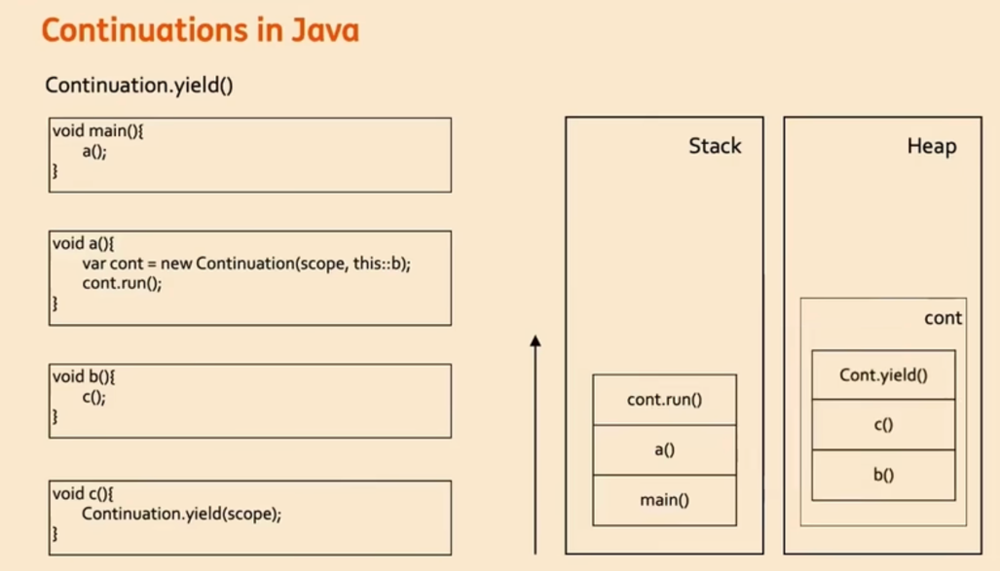
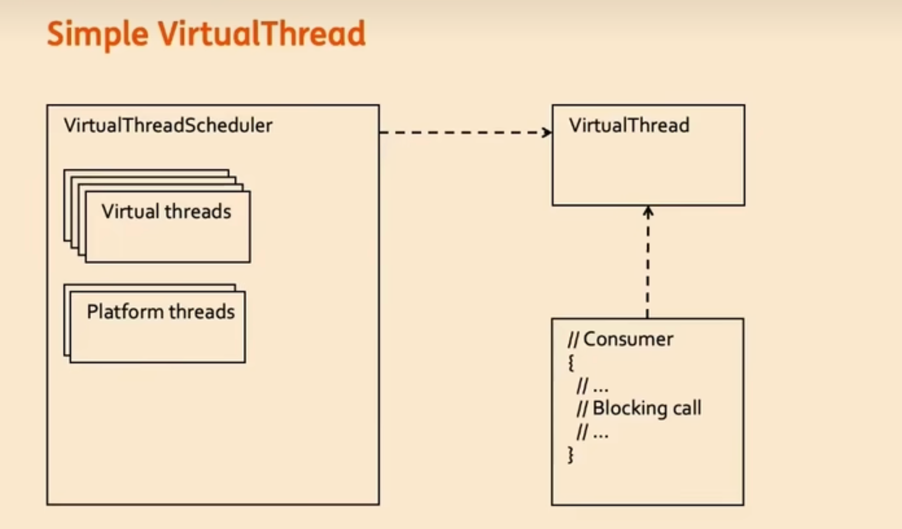

### 基础条件

---

- jdk21及以上
- 编译/运行时开启 `--enable-preview` & `--add-exports=java.base/jdk.internal.vm=ALL-UNNAMED`

### 简单使用

---

```java
public class ContinuationDemo {

    public static void main(String[] args) throws InterruptedException {
        var cont = getContinuation();
        cont.run();
        System.out.println("xxx");
        cont.run();
        System.out.println("yyy");
        cont.run();
        System.out.println("zzz");
    }

    private static Continuation getContinuation() {
        var scope = new ContinuationScope("Demo");
        var cont = new Continuation(scope, () -> {
            System.out.println("A");
            Continuation.yield(scope);
            System.out.println("B");
            Continuation.yield(scope);
            System.out.println("C");
        });
        return cont;
    }

}
```
#### ContinuationScope
1. 定义挂起边界: 只有在 `scope` 内才能被挂起
2. 实现嵌套和隔离: ContinuationScope 允许创建多个互相隔离的作用域，支持嵌套调用时的独立控制
   ```java
   ContinuationScope OUTER_SCOPE = new ContinuationScope("outer");
   ContinuationScope INNER_SCOPE = new ContinuationScope("inner");
   
   Continuation outer = new Continuation(OUTER_SCOPE, () -> {
       System.out.println("外层开始");
   
       Continuation inner = new Continuation(INNER_SCOPE, () -> {
           System.out.println("内层开始");
           Continuation.yield(INNER_SCOPE); // 只挂起内层
           System.out.println("内层继续");
       });
       
       while(!inner.isDone()) inner.run();
       
       Continuation.yield(OUTER_SCOPE); // 只挂起外层
       System.out.println("外层继续");
   });
   ```
3. 控制挂起权限
4. 安全性保障
5. 分层架构支持
6. 调试和监控支持

#### Continuation#yield
1. `挂起执行`：立即暂停当前 Continuation 的执行
2. `保存状态`：保存当前执行状态（包括调用栈、局部变量等）
3. `返回控制权`：将控制权返回到启动该 Continuation 的 run() 方法的`调用者`

##### 原理

1. 执行 `yield` 会返回 run() 方法的调用者，同时将堆栈信息保存到 `Continuation` 对象中
2. 当执行 `run` 时，会将控制权转移到最后一个 `yield` 的地方继续执行

##### 应用场景
1. 异步转同步
   ```java
   void fetchDataSynchronously() {
    ContinuationScope SCOPE = new ContinuationScope("io");
    Result result = null;
    
    Continuation cont = new Continuation(SCOPE, () -> {
        // 发起异步操作
        CompletableFuture<Result> future = service.fetchDataAsync();
        
        // 注册回调以恢复 Continuation
        future.whenComplete((r, ex) -> {
            result = r;
            scheduler.schedule(cont::run, 0, TimeUnit.MILLISECONDS);
        });
        
        // 挂起等待结果
        Continuation.yield(SCOPE);
        
        // 恢复后处理结果
        processResult(result);
    });
    
    // 开始执行
    cont.run();
   }
   ```
2. 实现协作式调度
   ```java
   void cooperativeTask() {
    ContinuationScope SCOPE = new ContinuationScope("task");
    
    Runnable task = () -> {
        for (int i = 0; i < 1000; i++) {
            // 做一些计算
            compute();
            
            // 每处理一定量数据就主动让出控制权
            if (i % 100 == 0) {
                Continuation.yield(SCOPE);
            }
        }
    };
    
    Continuation cont = new Continuation(SCOPE, task);
    
    // 循环执行直到完成
    while (!cont.isDone()) {
        cont.run();
        // 这里可以调度其他任务
    }
   }
   ```

### 实现简单的虚拟线程

---



#### 实现 VirtualThread
```java
public class VirtualThread {
    public static final ContinuationScope SCOPE = new ContinuationScope("VirtualThread");
    private static final AtomicInteger COUNTER = new AtomicInteger(1);
    private Continuation cont;
    private int id;

    public VirtualThread(Runnable runnable) {
        this.cont = new Continuation(SCOPE, runnable);
        this.id = COUNTER.getAndIncrement();
    }

    public void run() {
        System.out.printf("Virtual Thread %s is running on %s\n", id, Thread.currentThread());
        cont.run();
    }
}
```

#### 实现 VirtualThreadScheduler
```java
public class VirtualThreadScheduler {

    public static final ScopedValue<VirtualThread> CURRENT_VIRTUAL_THREAD = ScopedValue.newInstance();

    private Queue<VirtualThread> queue = new ConcurrentLinkedQueue<>();
    private ExecutorService executor = Executors.newFixedThreadPool(10);

    public void start() {
        while (true) {
            if (!queue.isEmpty()) {
                VirtualThread vt = queue.remove();
                // 创建一个新的执行环境，在该环境中CURRENT_VIRTUAL_THREAD的值被设置为vt
                // 这个值只在接下来的.run()方法执行的代码块中可见
                executor.submit(() -> ScopedValue.where(CURRENT_VIRTUAL_THREAD, vt).run(vt::run));
            }
        }
    }

    public void scheduler(VirtualThread vt) {
        queue.add(vt);
    }

}
```

#### 实现 WaitingOperation
> 模拟一些IO操作

```java
public class WaitingOperation {

    public static void perform(String name, int duration) {
        System.out.printf("wait for %s for %d seconds\n", name, duration);

        // 获取当前执行的vt
        var VirtualThread = VirtualThreadScheduler.CURRENT_VIRTUAL_THREAD.get();
        var timer = new Timer();
        timer.schedule(new TimerTask() {
            @Override
            public void run() {
                // 让vt继续执行
                SCHEDULER.scheduler(VirtualThread);
                timer.cancel();
            }
        }, duration * 1_000L);

        Continuation.yield(SCOPE);
    }

}
```

#### 测试
```java
public class Demo {

    public static final VirtualThreadScheduler SCHEDULER = new VirtualThreadScheduler();

    public static void main(String[] args) throws InterruptedException {
        new Thread(SCHEDULER::start).start();

        // 总数量: 4000
        // 一半任务需要2s，另外一半5s
        // 10个线程
        // 虚拟线程: 只需要 5s
        // 平台线程: 2000 * 2 / 10 + 2000 * 5 / 10 = 1400s

        long start = System.currentTimeMillis();

        int count = 2000;
        CountDownLatch countDownLatch = new CountDownLatch(count * 2);
        for (int i = 0; i < count; i++) {
            var vt1 = new VirtualThread(() -> {
                System.out.println("1.1");
                System.out.println("1.2");
                WaitingOperation.perform("Network", 2);
                System.out.println("1.3");
                System.out.println("1.4");
                countDownLatch.countDown();
            });

            var vt2 = new VirtualThread(() -> {
                System.out.println("2.1");
                System.out.println("2.2");
                WaitingOperation.perform("DB", 5);
                System.out.println("2.3");
                System.out.println("2.4");
                countDownLatch.countDown();
            });

            SCHEDULER.scheduler(vt1);
            SCHEDULER.scheduler(vt2);
        }


        countDownLatch.await();

        long end = System.currentTimeMillis();
        System.out.println("finish -> " + (end - start) + " ms");


    }
}
```
测试发现 2000个 2s 的任务，2000个 5s 的任务，在平台线程只有 `10` 的基础上只需要 `5s`