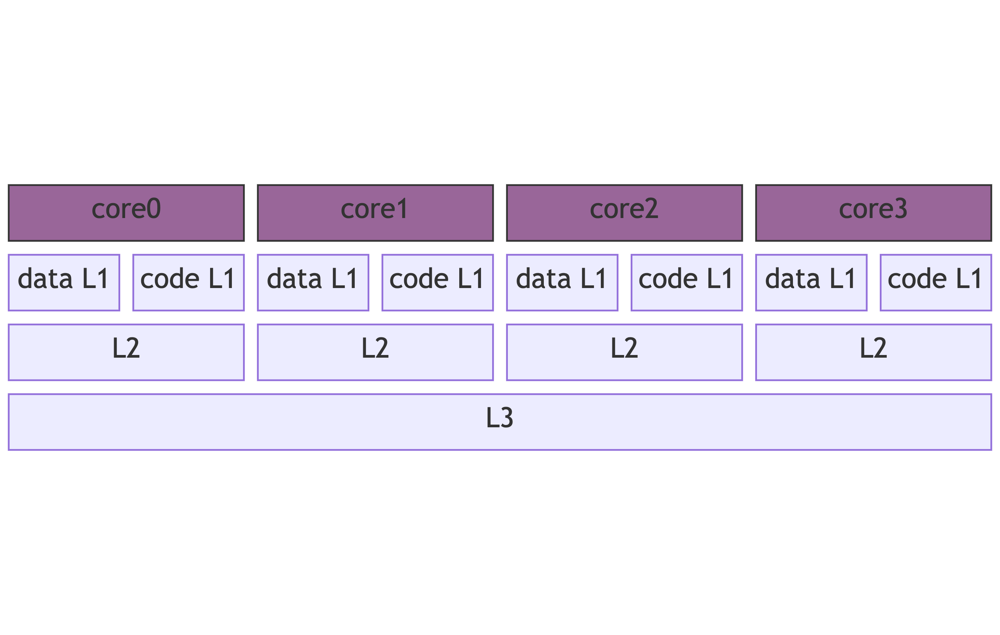
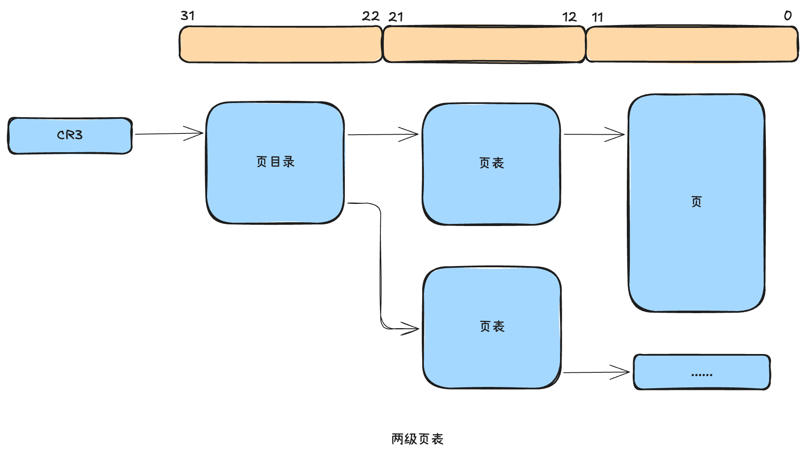
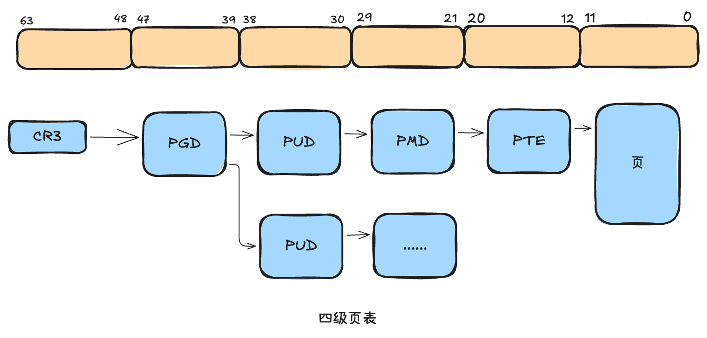

## CPU 硬件原理

---

### cpu 工作频率是多少
> 通过 `/proc/cpuinfo` 命令查看

```shell
cat /proc/cpuinfo | grep -i "MHz"
```

### 物理核与逻辑核

- 物理CPU: 主板上真正安装的 CPU 的个数，通过 `physical id` 命令可以查看。下面显示有一个物理 CPU，id是0
```shell
> cat /proc/cpuinfo | grep "physical id" | sort | uniq
physical id	: 0
```
- 物理核: 一个 CPU 会集成多个物理核，通过 `core id` 命令可以查看物理核的序号。下面显示每个 CPU 有 2 个物理核
```shell
> cat /proc/cpuinfo | grep "cpu cores"  | uniq
cpu cores	: 2
```
- 逻辑核: intel 运用了超线程计数，一个物理核可以被虚拟出多个逻辑核，processor 是逻辑核序号。processor 就是逻辑核的序号，可以看出
他们位于一个 CPU 的两个物理核上，一个物理核对应一个逻辑核
```shell
> cat /proc/cpuinfo | grep -E "core id|process|physical id"
processor	: 0
physical id	: 0
core id		: 0
processor	: 1
physical id	: 0
core id		: 1
```

### CPU 的 L1/L2/L3 缓存查看
> 现代 CPU 的速度比内存要快百倍以上，所以就逐步演化出了L1、L2、L3三级缓存结构了，而且都被集成到 CPU 芯片里，以进一步提高访问速度


```shell
block-beta
  columns 8
    core0:2
    core1:2
    core2:2
    core3:2 
    a["data L1"]:1
    b["code L1"]:1
    c["data L1"]:1
    d["code L1"]:1
    e["data L1"]:1
    f["code L1"]:1
    g["data L1"]:1
    h["code L1"]:1
    X1["L2"]:2
    X2["L2"]:2
    X3["L2"]:2
    X4["L2"]:2
    L3:8

 classDef front fill:#696,stroke:#333;
  classDef back fill:#969,stroke:#333;
  class Frontend front
  class core0,core1,core2,core3 back
```
- 物理距离上，L1最接近CPU，速度也`最快`，但是容量`最小`，一般CPU的L1会分成两个，一个用来缓存数据(cache data)，一个用来缓存代码(cache code)，这是因为code和data的更新策略并不相同，而且因为 CISC 的变长指令，code缓存要做特殊优化。一般每个核都有自己独立的data L1和code L1
- L2一般也可以做到每个核拥有一个独立的
- L3是整个CPU共享
```shell
# 查看cpu信息
# 这里看到的 cpu0、cpu1不是物理核，而是逻辑核
> cd /sys/devices/system/cpu;ll
drwxr-xr-x  6 root root    0 Mar 31 22:03 cpu0/
drwxr-xr-x  6 root root    0 Mar 31 22:03 cpu1/

# 查看 L1 缓存，index0和index1都是一级缓存，大小均是 32KB。index0用作数据缓存，index1用作代码缓存
# shared_cpu_list 输出的是该缓存被哪几个核锁共享，如果这里输出多个，表明机器开启了超线程，一个物理核心对应了多个逻辑核，共享的cpu属于一个物理核
> cat cpu0/cache/index0/level
1
> cat cpu0/cache/index0/size
32K
> cat cpu0/cache/index0/type
Data
> cat cpu0/cache/index0/shared_cpu_list 
0
> cat cpu0/cache/index1/type
Instruction

# 查看 L2 缓存，显示大小是 4M，type=Unified 表示不区分data、code
> cat cpu0/cache/index2/level
2
> cat cpu0/cache/index2/size
4096K
> cat cpu0/cache/index2/type
Unified
> cat cpu0/cache/index2/shared_cpu_list 
0

# 查看 L3 缓存，显示大小是 36M，但是 L3 是被整个物理 CPU 上的所有逻辑核所共享的
> cat cpu0/cache/index3/level
3
> cat cpu0/cache/index3/size
36608K
> cat cpu0/cache/index3/type
Unified
> cat cpu0/cache/index3/shared_cpu_list
0-1
```
#### `Cache Line`
> 本级缓存向下一级取数据时的基本单位并不是字节，而是一个比字节更大的单位——Cache Line。通过以下命令能看到Cache Line的大小都是`64`字节
```shell
> cat cpu0/cache/index1/coherency_line_size
64
```
- 每次cpu从内存获取数据，或者从L2、L3获取数据，都是以`64`字节为单位来进行的。哪怕只要取以为(bit)，CPU也是取一个 Cache Line，然后放到各级缓存里存起来
- 这就是`重视内存对其的底层原因`: 假设你有一个64字节大小的对象，如果地址对齐过，那一次内存IO就可以完成访问，如果没有对齐，就需要两次内存IO才行

### CPU 的 TLB 缓存
> 操作系统通过页表机制来实现进程的虚拟地址到物理地址的翻译，其中每一页的`大小`都是固定的

#### 页面大小
> 可以看到当前linux机器的页表是 16KB 的大小
```shell
> getconf PAGE_SIZE
16384
```
#### 页表级数
- 页表级数越小，虚拟地址到物理地址的`映射`越快，但是需要管理的页表项也会越多，能支持的地址空间也越有限
- 相反，页表级数越多，需要存储的页表数据就会越少，而且能支持的地址空间越大，但是虚拟地址到物理地址的映射就会越慢

32位操作系统时代，一般采用的是两级页表


现在的操作系统需要支持48位地址空间(理论上可以支持64位，但其实现在只支持到48位，也足够用了)，所以32位操作系统时代的两级页表也不够用了，需要进一步提高页表的级数，linux在2.6.11版以后，最终采用的方案是4级页表，如下图所示

- PGD: Page Global Directory，页全局目录，管理地址空间的39~47位
- PUD: Page Upper Directory，页上级目录，管理地址空间的30~38位
- PMD: Page Middle Directory，页中级目录，管理地址空间的21~29位
- PTE: Page Table Entry，页表项，管理地址空间的12~20位

这样，一个64位的虚拟空间，在初始创建的时候，只需要维护一个2^9大小的页全局目录，页表中数据条目需要占8字节，这个页全局目录仅需要(2^9 * 8)=4Kb的大小，剩下的页上级目录、页中级目录、页表项在使用的时候再分配。linux通过这种方式支持起(2^48)=256TB的进程地址空间。

#### TLB
> 每一级的页表是存储在内存里的，在完成一个虚拟地址转换的过程中，需要把当前虚拟地址对应的四个页表全部找出来，才能完成从虚拟地址到物理地址的转换。说明一次内存IO仅虚拟地址到物理地址的转换就要去内存查`4次`页表。再算上真正的内存访问，在最坏的情况下需要5次内存IO才能获取一个内存数据

和CPU的L1、L2、L3缓存思想一致，既然进行地址转换需要的内存IO次数多且耗时，那么就干脆在CPU里把页表中的数据尽可能的缓存起来，所以就有了TLB(Translation Lookaside Buffer)，这是专门用于加快虚拟地址到物理地址转换速度的缓存，访问速度非常快，和寄存器相当，比L1访问还快。

如果想查看本机的TLB缓存大小等信息，可以安装cpuid命令，该命令通过向CPU发送cpuid命令来获取CPU的硬件信息
```shell
# apt-get install cpuid（或者 yum install cpuid）
> cpuid
cache and TLB information (2):
   L1 TLB/cache information: 2M/4M pages & L1 TLB (0x80000005/eax):
      instruction # entries     = 0xff (255)
      instruction associativity = 0x1 (1)
      data # entries            = 0xff (255)
      data associativity        = 0x1 (1)
   L1 TLB/cache information: 4K pages & L1 TLB (0x80000005/ebx):
      instruction # entries     = 0xff (255)
      instruction associativity = 0x1 (1)
      data # entries            = 0xff (255)
      data associativity        = 0x1 (1)
   L2 TLB/cache information: 2M/4M pages & L2 TLB (0x80000006/eax):
      instruction # entries     = 0x0 (0)
      instruction associativity = L2 off (0)
      data # entries            = 0x0 (0)
      data associativity        = L2 off (0)
   L2 TLB/cache information: 4K pages & L2 TLB (0x80000006/ebx):
      instruction # entries     = 0x200 (512)
      instruction associativity = 4-way (4)
      data # entries            = 0x200 (512)
      data associativity        = 4-way (4)
```
| Level | Page Size  | Type | Entries | Associativity |
|--------|------------|------|----------|---------------|
| L1 TLB | 2M/4M(大页面) | 指令   | 255 | 1-way(直接映射)       |
| L1 TLB | 2M/4M      | 数据   | 255 | 1-way         |
| L1 TLB | 4K(标准页面)   | 指令   | 255 | 1-way         |
| L1 TLB | 4K         | 数据 | 255 | 1-way         |
| L2 TLB | 2M/4M      | 指令   | 0 | Off           |
| L2 TLB | 2M/4M      | 数据 | 0 | Off           |
| L2 TLB | 4K         | 指令   | 512 | 4-way（4路组相连）         |
| L2 TLB | 4K         | 数据 | 512 | 4-way         |

有了TLB之后，CPU访问某个虚拟内存地址过程如下，由于第二步是类似于寄存器的访问速度，所以如果TLB能命中，则虚拟地址到物理地址的时间开销小到可以忽略。
1. CPU产生一个虚拟地址
2. MMU从TLB获取页表，翻译成物理地址
3. MMU把物理地址发送给L1/L2/L3内存
4. L1/L2/L3内存将地址对应数据返回CPU

TLB虽然加速了页表的访问，但是TLB的大小并没有大到能装进所有的页表项，所以如果能减少页表项整体的大小，就能提高TLB缓存命中率，进而提升程序的整体运行性能。 在linux中运行使用大内存页，可以将默认的页面大小从4KB修改为2MB，甚至更大，这样能大大减少页表项，TLB Miss也会大大降低。增加页面大小所要承担的代价就是会造成一定程度的内存浪费。在linux中，大内存页默认是不开启的。


