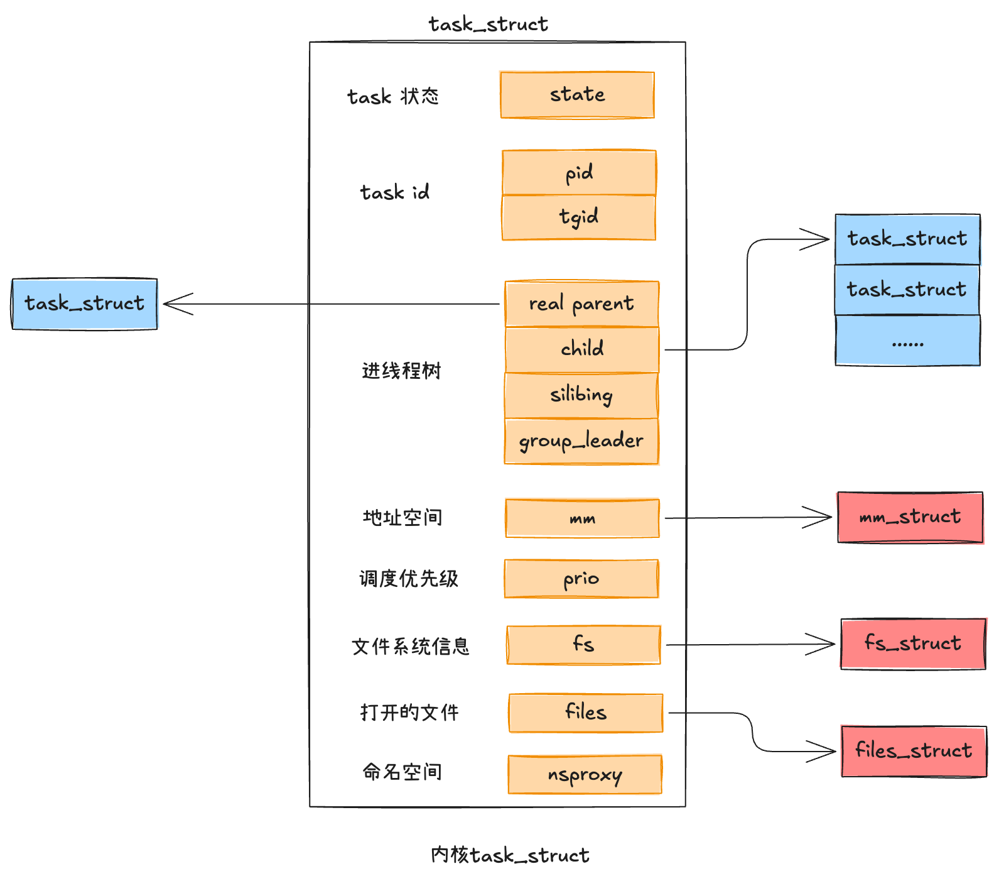
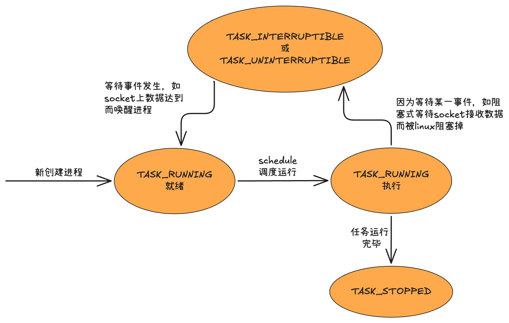
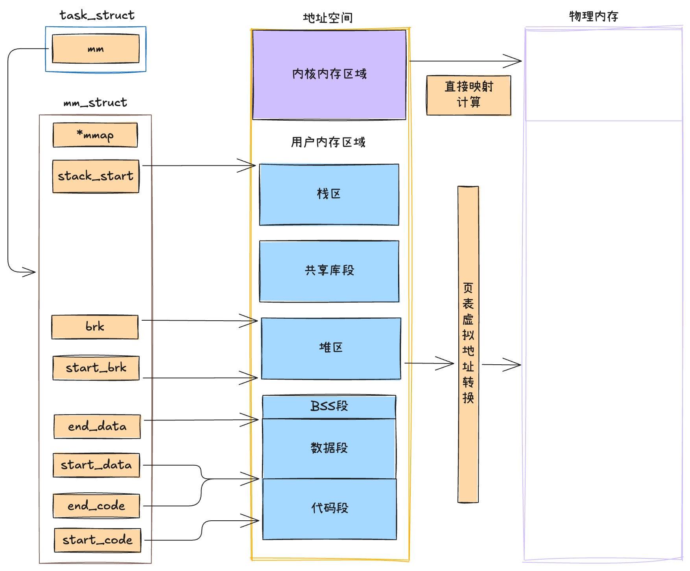
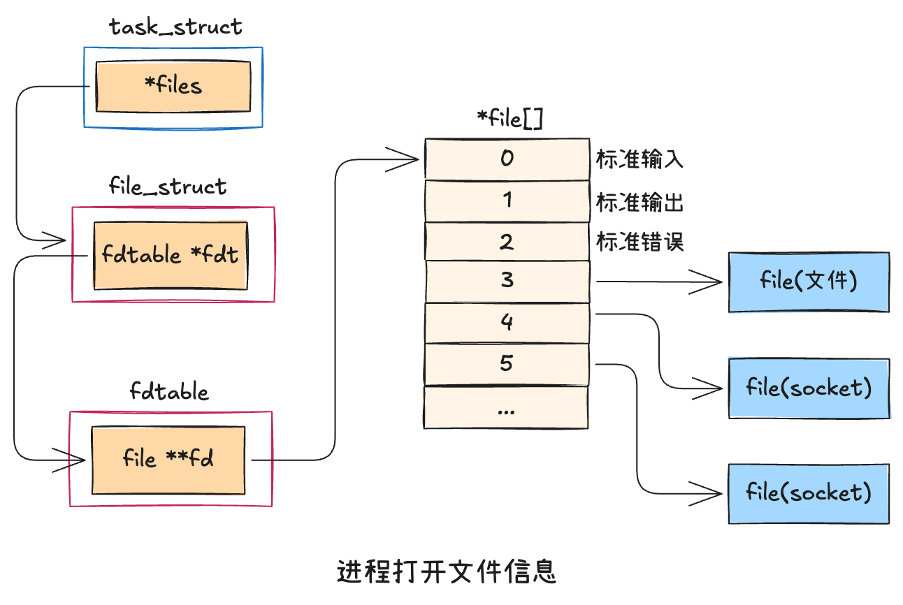

## 进程、线程定义

---

> 在Linux中进程与线程的相同点要远远大于不同点。在操作系统的理论中，进程和线程分别使用进程控制块PCB和线程控制块TCB来表示的。但其实在linux的视线里，无论是进程还是线程，都抽象成了任务，在源码里使用`task_struct`结构来实现

### 进程、线程状态
> 进程、线程都是有状态的，它的状态就保存在`state`字段中

### 进程ID与线程ID
- `pid`是linux为了标识每一个进程而分配给它的唯一号码，称作进行ID，简称PID。对于没有创建线程的进程（只包含一个主线程），这个pid就是进程的PID，`tgid`和`pid`是相同的
- 从内核的角度看，用户态的线程本质上还是一个进程。只不过和普通线程的区别是会和`父进程共享`虚拟地址空间等数据结构，会更轻量一些，所以在linux下的线程也叫轻量级线程。
- 假如一个进程下创建了多个线程，`每个线程的pid都是不一样的`，这是内核唯一标识他们的地方，所以必须不一致。他们通过`tgid`字段来表示自己所属的进程ID。
- 对于用户程序来说，调用`getpid()`函数其实返回的是`tgid`，这样无论进程还是线程获取到的进程id看起来都符合我们的预期了

### 进程树关系
> Linux下所有的进程都是通过一棵树来管理的。在操作系统启动的时候，会创建`init`进程，接下来所有的进程都是由这个进程直接或者间接创建的。通过`pstree`命令可以查看当前服务器上的进程树信息。

### 进程调度优先级
> Linux中的调度，主要分实时进程调度和普通进程调度

- 普通进程采用的调度器是CFS(Completely Fair Scheduler，完全公平调度器)
- 实时进程调度: 高优先级实时进程可抢占低优先级	

### 进程地址空间
> 对于用户进程来说，`mm_struct`（mm代表的是memory descriptor，内存描述符）是非常核心的数据结构，整个进程的`虚拟地址空间部分`都是由它来表示的。进程在运行的时候，在用户态其所需要的内存数据，如代码、全局变量数据及 mmap 内存映射等都是通过mm_struct进行内存查找和寻址的。

- start_code、end_code分别指向代码段的开始与结尾，start_data和end_data共同决定数据段的区域，start_brk和brk中间是堆内存的位置，start_stack是用户态堆栈的其实地址。
- mm_stack中的所有的成员共同表示一个虚拟地址空间，当虚拟地址空间中的内存区域被访问的时候，会由CPU中的MMU配合TLB缓存来将虚拟地址转换成物理地址进行访问。
- 对于内核线程来说，由于它只固定工作在地址空间较高的那部分，所以并没有涉及对虚拟内存部分的使用。内核线程的mm_struct都是null。在内核内存区域，可以通过直接计算得出物理内存地址，并不需要复杂的页表计算。
- 区分一个任务该叫线程还是进程，一个主要的区分点就在于看它是否有独立的地址空间。如果有，就应该叫做进程，如果没有就应该叫做线程
- 对于内核任务来说，因为没有独立的地址空间，所以称之为线程更合适，应该叫内核线程而不是叫内核进程。

### 进程打开的文件信息
> 每个进程用一个files_struct结构来记录文件描述符的使用情况，这个files_struct结构称为用户打开文件表

- 在files_struct中，最重要的就是fdtable中包含的 `file **fd` 数组。这个数组的下标就是文件描述符。
- 数组元素记录了当前进程打开的每一个文件的指针。这个文件是linux中抽象的文件，可能是真的磁盘上的文件，也可能是一个socket。
- Linux会通过`fs.file-max`和`fs.nr_open`内核参数限制进程的打开文件句柄的数量，这个数量是通过 *file[] 数组要分配的下标来判断的。