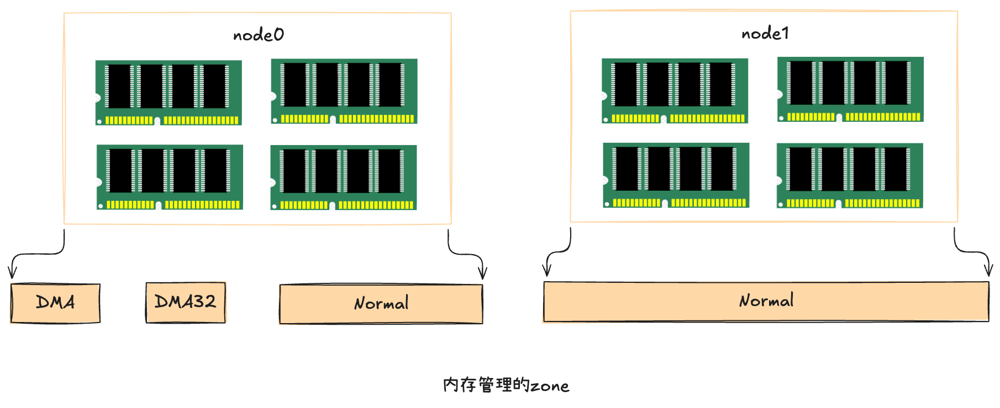
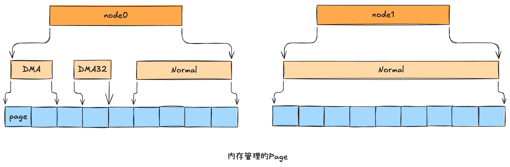

## 物理内存安装检测

---

> 在操作系统启动的时候要做的一件重要的事情就是探测可用物理内存的地址范围，内核请求中断号15H，并设置操作码为`E820H`，然后固件就会向内核报告可用的物理内存地址范围。因为操作码是E820，所以这个获取机制也常被称为`E820H`

## 初期memblock内存分配器

---

> 内核在启动时通过E820机制获得可用的内存地址范围后，还需要将这些内存都管理起来，以应对后面系统运行时的各种功能的内存申请。系统刚启动时采用的是初期分配器，这种内存分配器仅仅为了满足系统启动时对内存页的简单管理

### 向memblock分配器申请内存

#### crash kernel 内存申请
> 内核为了在崩溃时能记录崩溃的现场，方便以后排查分析，设计实现了一套`kdump机制`。kdump机制在服务器上启动了两个内核，第一个是正常使用的内核，第二个是崩溃发生时的应急内核。有了kdump机制，发生系统崩溃的时候kdump使用kexec启动到第二个内核中运行。这样第一个内核中的内存就得以保留下来。然后可以把崩溃时的所有运行状态都收集到dump core中。这套机制需要`额外的内存`才能工作。

#### 页管理初始化
> 将来linux的伙伴系统是按页的方式来管理所有的物理内存的，页的大小是4KB。每一个页都需要使用一个 `struct page` 对象来表示。这个对象也是需要消耗内存的，在不同的版本中，struct page 的大小不一样，一般是 64 字节。

## NUMA 信息感知

---

> NUMA的全称是 Non-uniform memory access，是`非一致性内存访问`的意思。每个 CPU 都可以连接几条内存。两个 CPU 之间如果想要访问对方连接的内存条，中间就要跨过 UPI 总线。CPU扩展性的设计极大的提升了服务器上的CPU核数和内存容量。但同时也带来了另外一个问题，那就是CPU物理核在访问不同的内存条的延迟是不同的，这就是非一致性内存访问的含义。

### Linux获取NUMA信息

#### 内核识别内存所属节点
- SRAT(System Resource Affinity Table)，在这个表中表示的是CPU核和内存的关系图。包括有几个node，每个node里面有哪几个CPU逻辑核，有哪些内存。
- SLIT(System Locality Information Table)，在这个表中记录的是各个节点之间的距离

在读取并解析完`SRAT`表后，linux操作系统就知道内存和node的关系了。NUMA信息最后都保存在 numa_meminfo 这个数据结构中，这是一个全局的列表，每一项都是(起始地址，结束地址，节点编号)的三元组，描述了内存块与NUMA节点的关联关系。

#### memblock分配器关联NUMA信息
> 内核创建好了memblock内存分配器，也通过固件获得了内存块的节点信息，接着还需要把NUMA信息写到memblock分配器中


## 物理页管理之伙伴系统

---

### 伙伴系统相关数据结构
> 在NUMA初始化的时候，linux内核会从固件ACPI中读取NUMA信息，其中包括当前系统node的划分

```shell
# 使用 numctl 命令看到每个node的情况
> numactl --hardware
available: 1 nodes (0)
node 0 cpus: 0 1
node 0 size: 3936 MB
node 0 free: 527 MB
node distances:
node   0 
  0:  10 
```
内核会为每一个node申请一个管理对象，之后会在每个node下创建各个zone，如下图所示


zone表示内存中的一块范围，有不同的类型:
- `ZONE_DMA`: 地址段最低的一块内存区域，支持ISA(Industry Standard Architecture) 设备DMA访问
- `ZONE_DMA32`: 该Zone用于支持32位地址总线的DMA设备，只在64位系统里才有效
- `ZONE_NORMAL`: 在X86-64架构下，DMA和DMA32之外的内存全部在NORMAL的Zone里管理。

每个zone下都包含了许许多多个Page(页面)，在Linux下一个Page的大小一般是4KB，如下图所示


