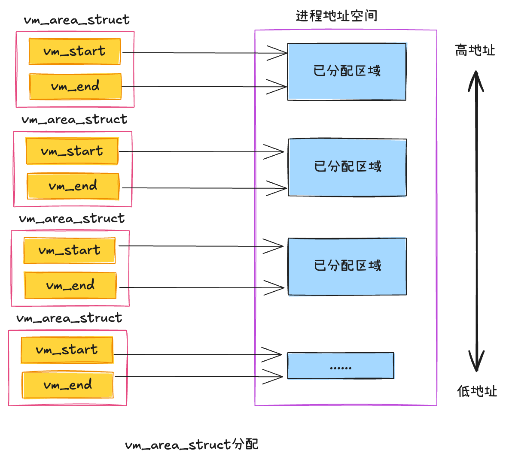
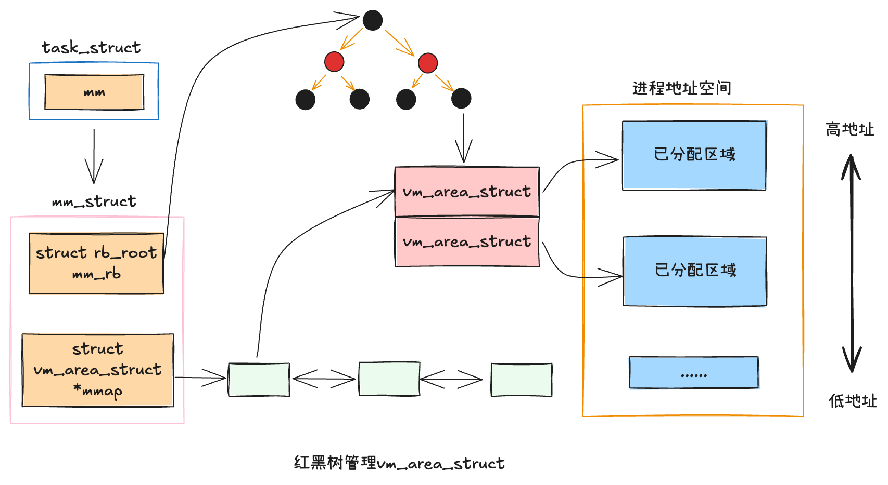

## 虚拟内存和物理页
> 在内存使用中，一个非常重要的概念就是`虚拟内存和物理内存的关系`，理解清楚这二者的联系与区别非常重要

### 虚拟地址空间
> 虚拟内存的管理是以`进程`为单位的，每个进程都有一个虚拟地址空间。在实现上，每个进程的task_struct都有一个核心对象——`mm_struct`类型的mm。它代表的就是进程的虚拟地址空间。

在这个虚拟地址空间中，每一段已经分离出去的地址范围都是用一个个虚拟内存区域`VMA(Virtual Memory Area)`来表示的，在内核中对应的结构体是 `vm_area_struct`。
```c
// include/linux/mm_types.h
// https://github.com/torvalds/linux/blob/master/include/linux/mm_types.h
struct vm_area_struct {
    unsigned long vm_start;
    unsigned long vm_end;
    ......
}
```
`vm_start`和`vm_end`表示启用的虚拟地址范围的开始和结束。当进程运行一段时间后，可能会分配出去许多段地址范围。那就会存在许多vm_area_struct对象，如下图所示:


许多个vm_area_struct对象各自所指明的已分配出去的地址范围，加起来就是对整个虚拟地址空间的占用情况。当然，内核会保证各个vm_area_struct对象之间的地址范围不存在交叉的情况。

在linux6.1版本之前，使用红黑树+双向链表管理`vm_area_struct`对象，如下图所示；在linux6.1版本中，对VMA的管理被替换成了`mapple tree`，原因是现在服务器上的核数越来越多，应用程序的线程也越来越多，多线程情况下锁争抢的问题开始出现，mapple tree从一开始就按照无锁的方式来设计的。



### 缺页中断
> 当在用户进程申请内存的时候，其实申请到的只是一个`vm_area_struct`，`仅仅是一段地址范围`。并不会立即分配物理内存，具体的分配要等到`实际访问`的时候。当进程在运行的过程中在栈上开始分配和访问变量的时候，如果物理页还没有分配，会触发`缺页中断`。在缺页中断中来真正的分配物理内存。

```c
// arch/x86/mm/fault.c
// https://github.com/torvalds/linux/blob/master/arch/x86/mm/fault.c
static inline
void do_user_addr_fault(struct pt_regs *regs,
			unsigned long error_code,
			unsigned long address)
{
    ......
    // 根据新的address查找对应的vma
    vma = find_vma(mm, address);
    ......
    
    good_area:
        // 调用handle_mm_fault来完成真正的内存申请
        fault = handle_mm_fault(mm, vma, address, flags);
}
```


