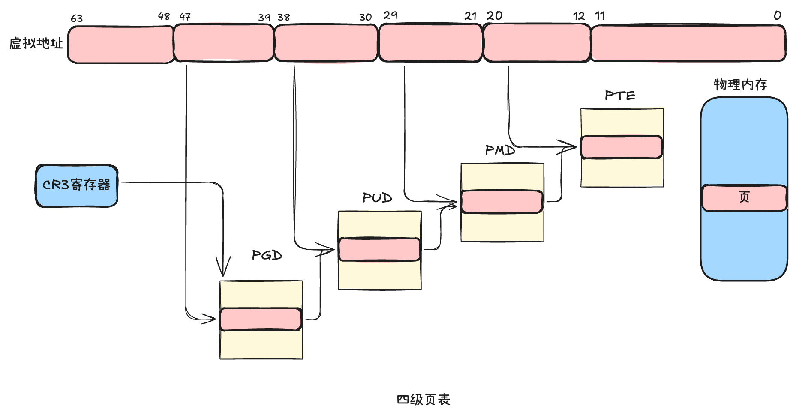
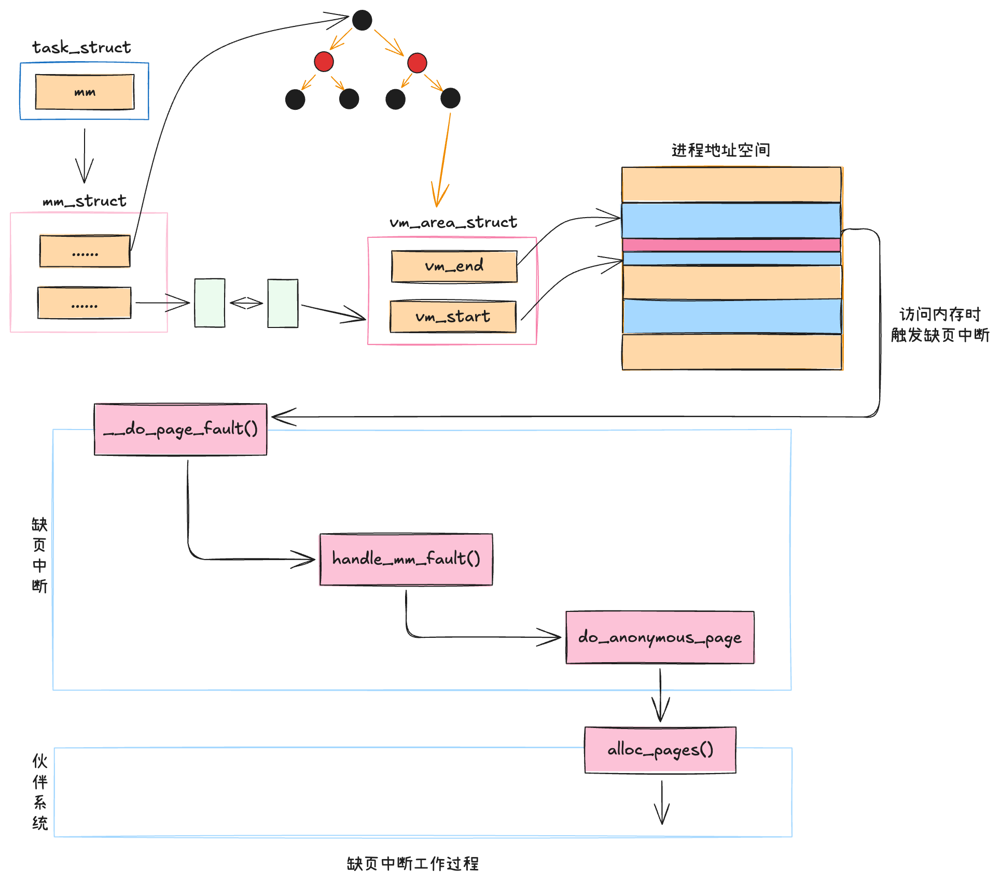
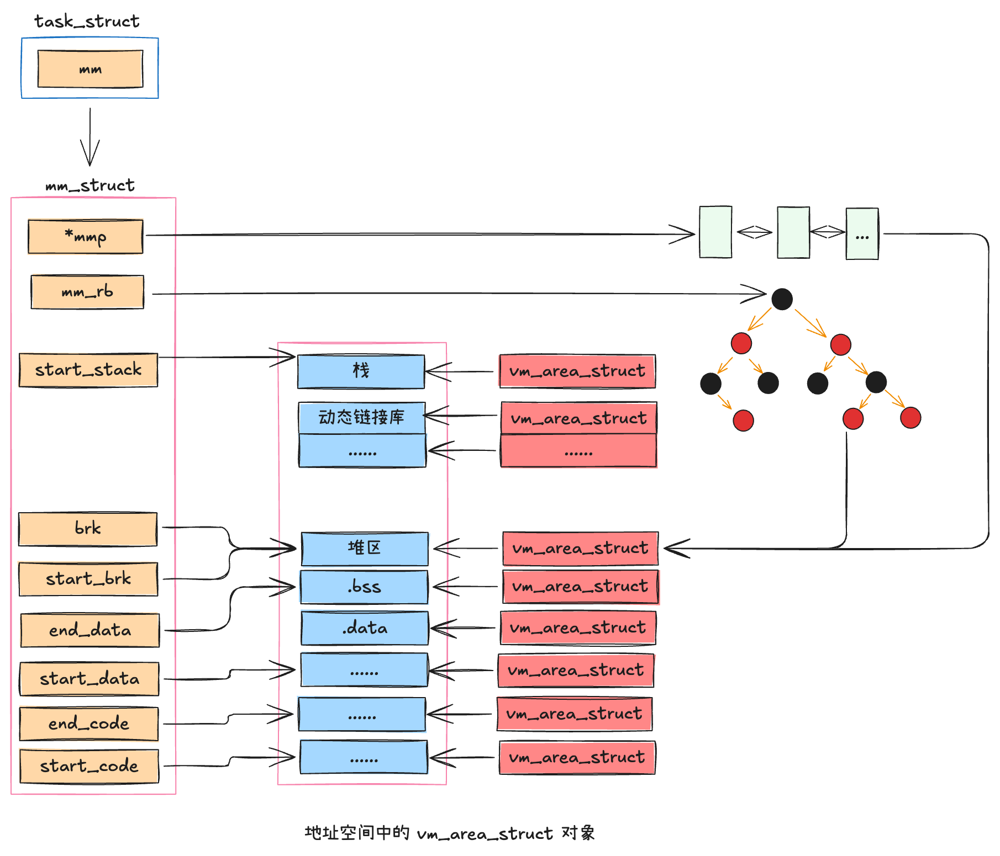

## 虚拟内存和物理页
> 在内存使用中，一个非常重要的概念就是`虚拟内存和物理内存的关系`，理解清楚这二者的联系与区别非常重要

### 虚拟地址空间
> 虚拟内存的管理是以`进程`为单位的，每个进程都有一个虚拟地址空间。在实现上，每个进程的task_struct都有一个核心对象——`mm_struct`类型的mm。它代表的就是进程的虚拟地址空间。

在这个虚拟地址空间中，每一段已经分离出去的地址范围都是用一个个虚拟内存区域`VMA(Virtual Memory Area)`来表示的，在内核中对应的结构体是 `vm_area_struct`。
```c
// include/linux/mm_types.h
// https://github.com/torvalds/linux/blob/master/include/linux/mm_types.h
struct vm_area_struct {
    unsigned long vm_start;
    unsigned long vm_end;
    ......
}
```
`vm_start`和`vm_end`表示启用的虚拟地址范围的开始和结束。当进程运行一段时间后，可能会分配出去许多段地址范围。那就会存在许多vm_area_struct对象，如下图所示:


许多个vm_area_struct对象各自所指明的已分配出去的地址范围，加起来就是对整个虚拟地址空间的占用情况。当然，内核会保证各个vm_area_struct对象之间的地址范围不存在交叉的情况。

在linux6.1版本之前，使用红黑树+双向链表管理`vm_area_struct`对象，如下图所示；在linux6.1版本中，对VMA的管理被替换成了`mapple tree`，原因是现在服务器上的核数越来越多，应用程序的线程也越来越多，多线程情况下锁争抢的问题开始出现，mapple tree从一开始就按照无锁的方式来设计的。


### 缺页中断
> 当在用户进程申请内存的时候，其实申请到的只是一个`vm_area_struct`，`仅仅是一段地址范围`。并不会立即分配物理内存，具体的分配要等到`实际访问`的时候。当进程在运行的过程中在栈上开始分配和访问变量的时候，如果物理页还没有分配，会触发`缺页中断`。在缺页中断中来真正的分配物理内存。

```c
// arch/x86/mm/fault.c
// https://github.com/torvalds/linux/blob/master/arch/x86/mm/fault.c
static inline
void do_user_addr_fault(struct pt_regs *regs,
			unsigned long error_code,
			unsigned long address)
{
    ......
    // 根据新的address查找对应的vma
    vma = find_vma(mm, address);
    ......
    
    good_area:
        // 调用handle_mm_fault来完成真正的内存申请
        fault = handle_mm_fault(mm, vma, address, flags);
}
```

1. 凡是用户空间的地址，都调用 `do_user_addr_fault` 进行缺页中断的处理。子这个函数中调用 find_vma 根据变量地址 address，通过遍历管理所有 vm__area_struct 的双向链表，找到其所在的 vma 对象。
2. 找到正确的 vma（要访问的变量地址address处于其vm_start和vm_end之间）后，缺页中断函数 do_user_addr_fault 会依次调用 handle_mm_fault -> __handle_mm_fault 来`完成真正的物理内存申请`。

```c
// https://github.com/torvalds/linux/blob/master/include/linux/mm.h
struct vm_fault {
    const struct {
    struct vm_area_struct *vma;	 // 缺页VMA
    unsigned long address;		 // 缺页地址
    ......
    };
    
    pmd_t *pmd; // 二级页表项
    pud_t *pud; // 三级页表项
    pte_t *pte; // 四级页表项
}

// https://github.com/torvalds/linux/blob/master/mm/memory.c
static vm_fault_t __handle_mm_fault(struct vm_area_struct *vma,
		unsigned long address, unsigned int flags)
{
	struct vm_fault vmf = {
		.vma = vma,
		.address = address & PAGE_MASK,
		.real_address = address,
		......
	}; 
	......
	
	// 依次查看或申请每一级页表
	pgd = pgd_offset(mm, address);
	p4d = p4d_alloc(mm, pgd, address);
	......
	vmf.pud = pud_alloc(mm, p4d, address);
	......
	vmf.pmd = pmd_alloc(mm, vmf.pud, address);
	......
	return handle_pte_fault(&vmf);
}
```
在__handle_mm_fault函数中，又将各种参数都统一整合到了一个参数对象vm_fault中，包括发生缺页的内存地址address，也包括中间的各级页表项。



在检查或申请好所需要的各级页表项后，进入 do_anonymous_page 函数处理。在 `handle_pte_fault` 函数中会进行很多种内存缺页处理，比如文件映射缺页处理、swap缺页处理、写时复制缺页处理、匿名映射页处理等。开发者申请的变量内存对应的是匿名映射页处理，会进入 `do_anonymous_page` 函数。在 do_anonymous_page 函数中调用 `alloc_zeroed_user_highpage_movable` 分配一个可移动的匿名物理页。在底层会调用伙伴系统的 `allc_page` 进行实际物理页面的分配。
```c
// https://github.com/torvalds/linux/blob/master/mm/memory.c
static vm_fault_t handle_pte_fault(struct vm_fault *vmf)
{
    vmf->pte = pte_offset_map_rw_nolock(vmf->vma->vm_mm, vmf->pmd,
                        vmf->address, &dummy_pmdval,
                        &vmf->ptl);
    ......
    // 匿名映射页处理
    return do_anonymous_page(vmf);
    // 其他处理
    .....
}

static vm_fault_t do_anonymous_page(struct vm_fault *vmf)
{   
    // 分配可移动的匿名页面，底层通过 allc_page 支持
    page = alloc_zeroed_user_highpage_movable(vma, vmf -> address);
}
```


---

## 虚拟内存使用方式
> 整个进程的运行过程几乎都是围绕着对虚拟内存的分配和使用而进行的。对于每一种内存使用方式，在底层都是申请 `vm_area_struct` 来实现的。

操作系统加载程序时在加载逻辑里对新进程的虚拟内存进行设置和使用，具体包括:
- 程序启动时，加载程序会将程序代码段、数据段通过mmap映射到虚拟地址空间
- 堆新进程初始化栈区和堆区。

程序运行期间动态地对所存储的各种数据进行申请和释放。这涉及的一类是栈，进程、线程运行时函数调用，存储局部变量都使用的是栈。另一类是堆，各种开发语言的运行时通过 new、malloc等函数从堆中分配内存。这类内存的申请和释放需要依赖操作系统提供的虚拟地址空间相关的 mmap、brk的等系统调用来实现。

### 进程启动时对虚拟内存的使用
在进程加载过程中，解析完ELF文件信息后将:
- 为进程创建新的地址空间，同时给其准备一个默认大小为4KB的栈。
- 将可执行文件及其所以来的各种so动态链接库通过elf_map函数映射到虚拟地址空间中。
- 还会对进程的堆区进行初始化

在底层实现上，无论是代码段、数据段，还是栈内存、堆内存，都对应着一个个的 `vm_area_struct` 对象。每一个 vm_area_struct 对象都表示这段虚拟内存地址空间已经分配和使用了。如下图所示


#### 栈内存使用
对于栈，是在 execve 中依次调用 do_execve_common、bprm_mm_init，最后在 __bprm_mm_init 中申请 vm_area_struct 对象。
```c
// file:fs/exec.c
// https://github.com/torvalds/linux/blob/master/fs/exec.c
static int __bprm_mm_init(struct linux_binprm *bprm)
{
    struct mm_struct *mm = bprm->mm;
    // 申请占用一段地址范围
    bprm->vma = vma = vm_area_alloc(mm);
	vma->vm_end = STACK_TOP_MAX;
	vma->vm_start = vma->vm_end - PAGE_SIZE;
	......
}
```
#### 可执行文件及进程所依赖的各种so动态链接库
是在 execve 中依次调用 do_execve_common、search_binary_handler、load_elf_binary、elf_map，然后调用 mmap_region 申请 vm_area_struct 对象，最终将可执行文件中的代码段、数据段等映射到内存中的。
```c
// file:mm/mmap.c
// https://github.com/torvalds/linux/blob/master/mm/vma.c#L2528
unsigned long mmap_region(struct file *file, unsigned long addr,
			  unsigned long len, vm_flags_t vm_flags, unsigned long pgoff,
			  struct list_head *uf)
{
    ......
    vma = vm_area_alloc(mm);
    vma -> vm_start = addr;
    vma -> vm_end = addr + len;
    ......
    return addr;
}
```

#### 堆内存使用
对于堆内存，是在 load_elf_binary 的最后 set_brk 初始化堆时，依次调用 vm_brk_flags、do_brk_flags，最后申请 vm_area_struct 对象。
```c 
// file:mm/mmap.c
// https://github.com/torvalds/linux/blob/master/mm/vma.c#L2576
int do_brk_flags(struct vma_iterator *vmi, struct vm_area_struct *vma,
		 unsigned long addr, unsigned long len, unsigned long flags)
{
    ......
    // 申请虚拟地址空间范围对象
    vma = vm_area_alloc(mm);
    // 对其进行初始化
    vma_set_anonymous(vma);
    vma -> vm_start = addr;
    vma -> vm_end = addr + len;
    vma -> vm_pgoff = pgoff;
    vma -> vm_flags = flags;
}
```

### mmap
在与虚拟内存管理相关的系统调用中，最接近底层实现而且最常用的，算是`mmap`。在各种运行时库（比如glibc、Go运行时）中，经常能看到对它的使用。这个系统调用可以用于文件映射和匿名映射。（匿名映射没有对应的物理文件，可以理解为铍铜内存地址空间）。

匿名映射过程其实是在向内核申请一段可用的内存地址范围，非常简单，当 `mmap` 被调用后，内核就会多申请一个 `vm_area_struct`，表明这段内存可用，然后返回给用户。在 `mmap_region` 中调用 `vm_area_alloc` 申请了一个新的 vm_area_struct 对象，对其进行初始化。这样用户申请的虚拟内存就分配好了。函数返回后用户就可以使用了。
