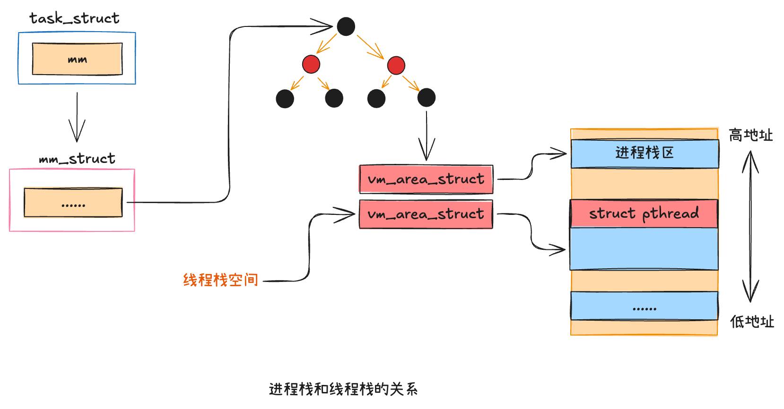
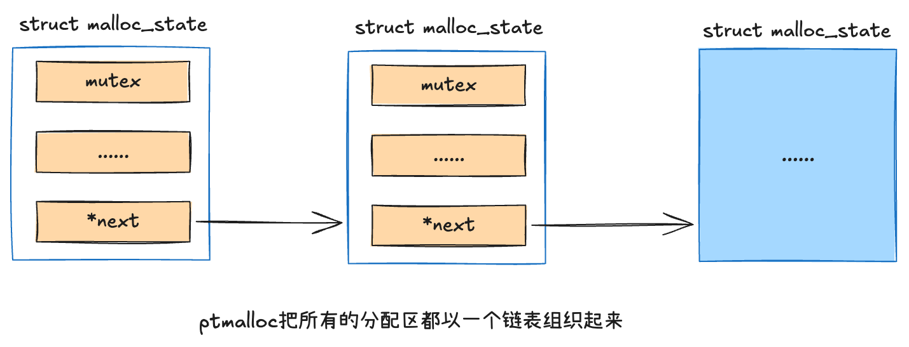
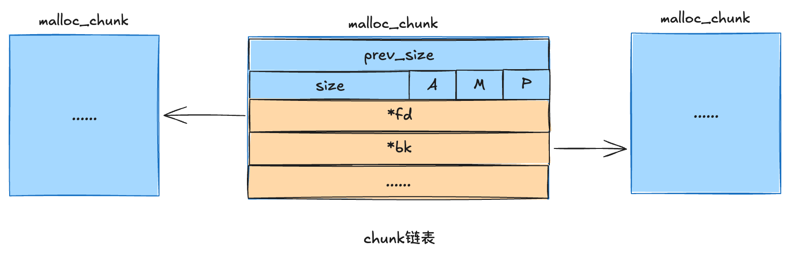
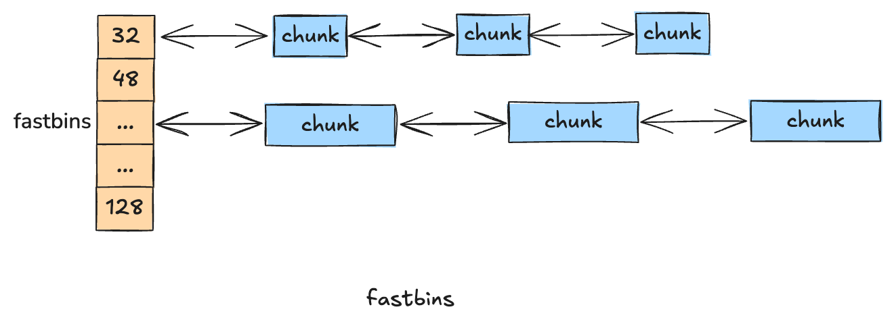
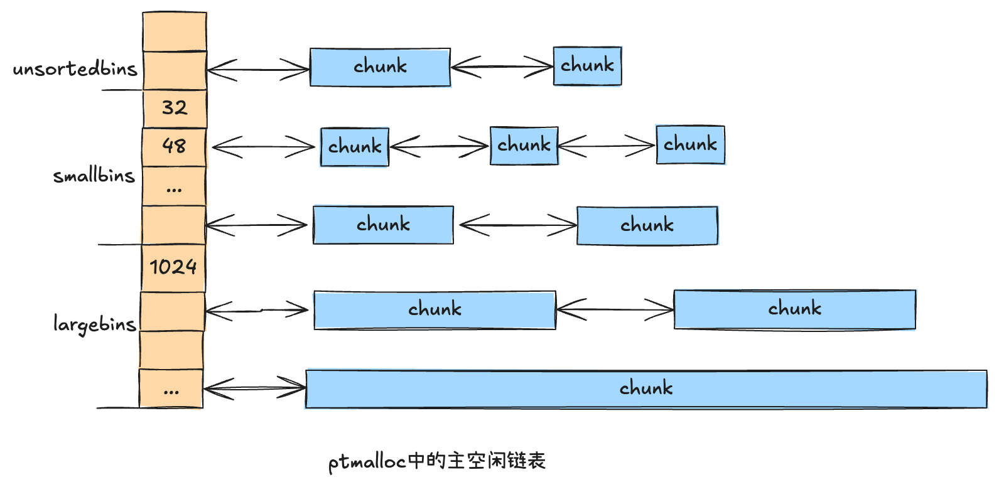
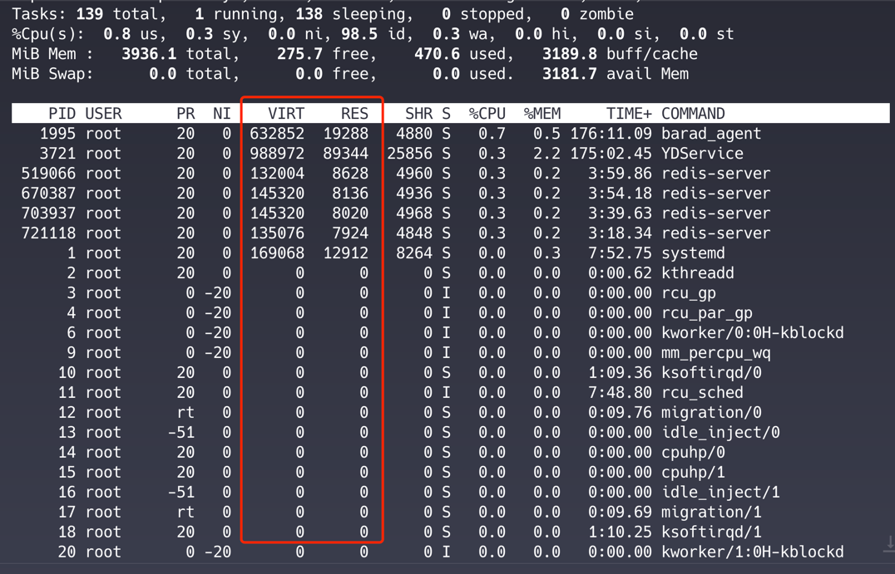

## 虚拟内存和物理页
> 在内存使用中，一个非常重要的概念就是`虚拟内存和物理内存的关系`，理解清楚这二者的联系与区别非常重要

### 虚拟地址空间
> 虚拟内存的管理是以`进程`为单位的，每个进程都有一个虚拟地址空间。在实现上，每个进程的task_struct都有一个核心对象——`mm_struct`类型的mm。它代表的就是进程的虚拟地址空间。

在这个虚拟地址空间中，每一段已经分离出去的地址范围都是用一个个虚拟内存区域`VMA(Virtual Memory Area)`来表示的，在内核中对应的结构体是 `vm_area_struct`。
```c
// include/linux/mm_types.h
// https://github.com/torvalds/linux/blob/master/include/linux/mm_types.h
struct vm_area_struct {
    unsigned long vm_start;
    unsigned long vm_end;
    ......
}
```
`vm_start`和`vm_end`表示启用的虚拟地址范围的开始和结束。当进程运行一段时间后，可能会分配出去许多段地址范围。那就会存在许多vm_area_struct对象，如下图所示:


许多个vm_area_struct对象各自所指明的已分配出去的地址范围，加起来就是对整个虚拟地址空间的占用情况。当然，内核会保证各个vm_area_struct对象之间的地址范围不存在交叉的情况。

在linux6.1版本之前，使用红黑树+双向链表管理`vm_area_struct`对象，如下图所示；在linux6.1版本中，对VMA的管理被替换成了`mapple tree`，原因是现在服务器上的核数越来越多，应用程序的线程也越来越多，多线程情况下锁争抢的问题开始出现，mapple tree从一开始就按照无锁的方式来设计的。


### 缺页中断
> 当在用户进程申请内存的时候，其实申请到的只是一个`vm_area_struct`，`仅仅是一段地址范围`。并不会立即分配物理内存，具体的分配要等到`实际访问`的时候。当进程在运行的过程中在栈上开始分配和访问变量的时候，如果物理页还没有分配，会触发`缺页中断`。在缺页中断中来真正的分配物理内存。

```c
// arch/x86/mm/fault.c
// https://github.com/torvalds/linux/blob/master/arch/x86/mm/fault.c
static inline
void do_user_addr_fault(struct pt_regs *regs,
			unsigned long error_code,
			unsigned long address)
{
    ......
    // 根据新的address查找对应的vma
    vma = find_vma(mm, address);
    ......
    
    good_area:
        // 调用handle_mm_fault来完成真正的内存申请
        fault = handle_mm_fault(mm, vma, address, flags);
}
```

1. 凡是用户空间的地址，都调用 `do_user_addr_fault` 进行缺页中断的处理。子这个函数中调用 find_vma 根据变量地址 address，通过遍历管理所有 vm__area_struct 的双向链表，找到其所在的 vma 对象。
2. 找到正确的 vma（要访问的变量地址address处于其vm_start和vm_end之间）后，缺页中断函数 do_user_addr_fault 会依次调用 handle_mm_fault -> __handle_mm_fault 来`完成真正的物理内存申请`。

```c
// https://github.com/torvalds/linux/blob/master/include/linux/mm.h
struct vm_fault {
    const struct {
    struct vm_area_struct *vma;	 // 缺页VMA
    unsigned long address;		 // 缺页地址
    ......
    };
    
    pmd_t *pmd; // 二级页表项
    pud_t *pud; // 三级页表项
    pte_t *pte; // 四级页表项
}

// https://github.com/torvalds/linux/blob/master/mm/memory.c
static vm_fault_t __handle_mm_fault(struct vm_area_struct *vma,
		unsigned long address, unsigned int flags)
{
	struct vm_fault vmf = {
		.vma = vma,
		.address = address & PAGE_MASK,
		.real_address = address,
		......
	}; 
	......
	
	// 依次查看或申请每一级页表
	pgd = pgd_offset(mm, address);
	p4d = p4d_alloc(mm, pgd, address);
	......
	vmf.pud = pud_alloc(mm, p4d, address);
	......
	vmf.pmd = pmd_alloc(mm, vmf.pud, address);
	......
	return handle_pte_fault(&vmf);
}
```
在__handle_mm_fault函数中，又将各种参数都统一整合到了一个参数对象vm_fault中，包括发生缺页的内存地址address，也包括中间的各级页表项。


在检查或申请好所需要的各级页表项后，进入 do_anonymous_page 函数处理。在 `handle_pte_fault` 函数中会进行很多种内存缺页处理，比如文件映射缺页处理、swap缺页处理、写时复制缺页处理、匿名映射页处理等。开发者申请的变量内存对应的是匿名映射页处理，会进入 `do_anonymous_page` 函数。在 do_anonymous_page 函数中调用 `alloc_zeroed_user_highpage_movable` 分配一个可移动的匿名物理页。在底层会调用伙伴系统的 `allc_page` 进行实际物理页面的分配。
```c
// https://github.com/torvalds/linux/blob/master/mm/memory.c
static vm_fault_t handle_pte_fault(struct vm_fault *vmf)
{
    vmf->pte = pte_offset_map_rw_nolock(vmf->vma->vm_mm, vmf->pmd,
                        vmf->address, &dummy_pmdval,
                        &vmf->ptl);
    ......
    // 匿名映射页处理
    return do_anonymous_page(vmf);
    // 其他处理
    .....
}

static vm_fault_t do_anonymous_page(struct vm_fault *vmf)
{   
    // 分配可移动的匿名页面，底层通过 allc_page 支持
    page = alloc_zeroed_user_highpage_movable(vma, vmf -> address);
}
```


---

## 虚拟内存使用方式
> 整个进程的运行过程几乎都是围绕着对虚拟内存的分配和使用而进行的。对于每一种内存使用方式，在底层都是申请 `vm_area_struct` 来实现的。

操作系统加载程序时在加载逻辑里对新进程的虚拟内存进行设置和使用，具体包括:
- 程序启动时，加载程序会将程序代码段、数据段通过mmap映射到虚拟地址空间
- 堆新进程初始化栈区和堆区。

程序运行期间动态地对所存储的各种数据进行申请和释放。这涉及的一类是栈，进程、线程运行时函数调用，存储局部变量都使用的是栈。另一类是堆，各种开发语言的运行时通过 new、malloc等函数从堆中分配内存。这类内存的申请和释放需要依赖操作系统提供的虚拟地址空间相关的 mmap、brk的等系统调用来实现。

### 进程启动时对虚拟内存的使用
在进程加载过程中，解析完ELF文件信息后将:
- 为进程创建新的地址空间，同时给其准备一个默认大小为4KB的栈。
- 将可执行文件及其所以来的各种so动态链接库通过elf_map函数映射到虚拟地址空间中。
- 还会对进程的堆区进行初始化

在底层实现上，无论是代码段、数据段，还是栈内存、堆内存，都对应着一个个的 `vm_area_struct` 对象。每一个 vm_area_struct 对象都表示这段虚拟内存地址空间已经分配和使用了。如下图所示


#### 栈内存使用
对于栈，是在 execve 中依次调用 do_execve_common、bprm_mm_init，最后在 __bprm_mm_init 中申请 vm_area_struct 对象。
```c
// file:fs/exec.c
// https://github.com/torvalds/linux/blob/master/fs/exec.c
static int __bprm_mm_init(struct linux_binprm *bprm)
{
    struct mm_struct *mm = bprm->mm;
    // 申请占用一段地址范围
    bprm->vma = vma = vm_area_alloc(mm);
	vma->vm_end = STACK_TOP_MAX;
	vma->vm_start = vma->vm_end - PAGE_SIZE;
	......
}
```
#### 可执行文件及进程所依赖的各种so动态链接库
是在 execve 中依次调用 do_execve_common、search_binary_handler、load_elf_binary、elf_map，然后调用 mmap_region 申请 vm_area_struct 对象，最终将可执行文件中的代码段、数据段等映射到内存中的。
```c
// file:mm/mmap.c
// https://github.com/torvalds/linux/blob/master/mm/vma.c#L2528
unsigned long mmap_region(struct file *file, unsigned long addr,
			  unsigned long len, vm_flags_t vm_flags, unsigned long pgoff,
			  struct list_head *uf)
{
    ......
    vma = vm_area_alloc(mm);
    vma -> vm_start = addr;
    vma -> vm_end = addr + len;
    ......
    return addr;
}
```

#### 堆内存使用
对于堆内存，是在 load_elf_binary 的最后 set_brk 初始化堆时，依次调用 vm_brk_flags、do_brk_flags，最后申请 vm_area_struct 对象。
```c
// file:mm/mmap.c
// https://github.com/torvalds/linux/blob/master/mm/vma.c#L2576
int do_brk_flags(struct vma_iterator *vmi, struct vm_area_struct *vma,
		 unsigned long addr, unsigned long len, unsigned long flags)
{
    ......
    // 申请虚拟地址空间范围对象
    vma = vm_area_alloc(mm);
    // 对其进行初始化
    vma_set_anonymous(vma);
    vma -> vm_start = addr;
    vma -> vm_end = addr + len;
    vma -> vm_pgoff = pgoff;
    vma -> vm_flags = flags;
}
```

### mmap
在与虚拟内存管理相关的系统调用中，最接近底层实现而且最常用的，算是`mmap`。在各种运行时库（比如glibc、Go运行时）中，经常能看到对它的使用。这个系统调用可以用于文件映射和匿名映射。（匿名映射没有对应的物理文件，可以理解为铍铜内存地址空间）。

匿名映射过程其实是在向内核申请一段可用的内存地址范围，非常简单，当 `mmap` 被调用后，内核就会多申请一个 `vm_area_struct`，表明这段内存可用，然后返回给用户。在 `mmap_region` 中调用 `vm_area_alloc` 申请了一个新的 vm_area_struct 对象，对其进行初始化。这样用户申请的虚拟内存就分配好了。函数返回后用户就可以使用了。

### sbrk和brk
在进程启动后，exec系统调用会给进程初始化当前虚拟地址空间中的堆区，也设置好 start_brk 和 brk 等指针。
- `sbrk` 系统调用就是返回 mm_struct -> brk 指针的值
- `brk` 系统调用就是尝试修改 mm_struct -> brk，往大了改就是扩大堆区，往小了改就是要缩小堆区。

---

## 进程栈内存的使用

### 进程栈的初始化
申请完地址空间后，就给新进程的栈申请一页大小的虚拟内存空间，作为给新进程准备的栈内存。申请完后把栈的指针保存到 bprm -> p 中记录起来。这里看到的栈内存申请`只是申请一个表示一段地址范围的vma对象，并没有真正申请物理内存`。

### 栈的自动增长
进程在被加载、启动的时候，栈内存默认只分配了4KB的空间，那么随着程序的运行，当栈中保存的调用链、局部变量越来越多的时候就，必然超过4KB。再看看缺页处理函数 `__do_page_fault`，如果栈内存vma的开始地址要比访问的address大，则需要调用 `expand_stack` 对栈的虚拟地址空间进行扩充。

在 do_user_addr_fault 函数中，先判断要访问的变量地址address是否落在vma内部，如果落在内部就调用 `handle_mm_fault` 进行实际物理页的分配。如果address超过vma的范围（栈一般是向下增加的，如果vma->vm_start大于address表示栈不够用了）就调用 `expand_stack` 进行扩充。扩充逻辑中会判断此次栈空间是否被允许扩充，判断是在 `acct_stack_growth` 中完成的。如果允许扩充，则简单修改下以下 vma->vm_start 就可以了！

acct_stack_growth 函数都进行了哪些限制判断。
```c
// file:mm/vma.c
// https://github.com/torvalds/linux/blob/f4d2ef48250ad057e4f00087967b5ff366da9f39/mm/vma.c#L2760
static int acct_stack_growth(struct vm_area_struct *vma,
			     unsigned long size, unsigned long grow)
{
    ......
    // 检查地址空间是否超出限制
    if (!may_expand_vm(mm, vma->vm_flags, grow))
        return -ENOMEM;
    
    // 检查是否超出栈的大小限制
    if (size > rlimit(RLIMIT_STACK))
        return -ENOMEM;
        
    ......
    return 0;
}
```
may_expand_vm 判断的是增长完这几页后是否超出整体虚拟地址空间大小的限制。rlimit(RLIMIT_STACK) 中记录的是栈空间大小的限制。这些限制都可以通过 `ulimit -a` 命令查看。下面这个输出表示虚拟地址空间大小没有限制，栈空间的限制是 8MB。如果进程栈大小超过这个限制，会返回 `-ENOMEM`。如果觉得系统默认的大小不合适，可以通过 `ulimit` 命令修改。当栈溢出后应用程序会报 `Segmentation fault(core dumped)` 错误
```shell
> ulimit -a
max memory size         (kbytes, -m) unlimited
stack size              (kbytes, -s) 8192
virtual memory          (kbytes, -v) unlimited

# 修改命令
# ulimit -s 10240
# ulimit -a
# 长期修改建议采用修改 /etc/security/limits.conf 的方式
# vi /etc/security/limits.conf
.....
* soft stack 102400
```

### 进程栈总结
1. 进程在加载的时候给进程栈申请了一块虚拟地址空间vma内核对象。vm_start和vm_end之间留了一个Page，也就是说默认给栈准备了4KB的空间。
2. 当进程运行的过程中在栈上开始分配和访问变量的时候，如果物理页还没有分配，会触发缺页中断。在缺页中断中调用内核的伙伴系统真正的分配物理内存。
3. 当栈中的存储超过4KB时栈会自动进行扩大。不过大小要受到限制，其大小限制可以通过 `ulimit -s` 命令查看和设置。

---

## 线程栈是如何使用内存的
> 对于多线程程序而言，代码段、数据段、堆内存等资源共享没问题，但是各个线程栈区必须独立。每个线程在并行调用的时候会在栈上独立地执行进栈和出栈，如果都使用进程地址空间中默认的stack区域，多线程跑起来就乱套了。所以线程栈必须有自己独特的实现方法。

在linux内核中，其实并没有线程的概念。内核原生的clone系统调用仅支持生成一个和父进程共享地址空间等资源的轻量级进程而已。

要彻底理解Linux线程(NPTL线程)，首先要明确的是Linux中的线程包含了两部分的实现:
1. 第一部分是用户态的glibc库。创建线程调用的pthread_create就是在glibc库中实现的。glibc库完全是在`用户态运行`的，并非内核源码。
2. 第二部分是内核态的clone系统调用。内核通过clone系统调用可以创建和父进程共享内存地址空间的轻量级用户进程。
```c
// file:nptl/pthread_create.c
int __pthread_create_2_1(...)
{
    ......
    // glibc线程对象
    struct pthread *pd;
    // 确定栈空间大小
    // 申请用户栈
    err= ALLOCATE_STACK(iattr, &pd);
    .....
    // 创建线程
    err= create_thread(pd, iattr, STACK_VARIABLES_ARGS);
}
```
这个函数中的工作主要包括如下几个部分:
- 定义一个线程对象指针
- 确定栈空间大小
- 调用ALLOCATE_STACK为用户申请用户栈内存。
- 通过create_thread函数调用内核clone系统用来创建线程。

所以是`先申请内存，然后才调用系统创建的线程`。也就是说，Linux内核并没有处理线程栈内存，而是由glibc库在用户态申请后传给clone系统调用的。

### glibc线程对象
`struct pthread` 存储了线程的相关信息，包括线程栈。每个 pthread 对象都唯一对应一个线程。
```c
// file:nptl/descr.h
struct pthread 
{
    // 线程的ID值
    pid_t tid;
    ......
    // 指向了线程栈内存
    void *stackblock;
    // 栈内存区域的大小
    size_t stackblock_size;
}
```

### 确定栈空间大小
- 如果ulimit没有配置或者配置的是无限大，那么配置的大小是 ARCH_STACK_DEFAULT_SIZE(32MB)
- 如果配置的太小，可能导致程序无法正常运行，所以glibc库最小也会给 PTHREA_STACK_MIN(16KB)

### 申请用户栈
```c
// file:nptl/allocatestack.c
// https://github.com/lattera/glibc/blob/master/nptl/allocatestack.c
static int
allocate_stack (const struct pthread_attr *attr, struct pthread **pdp,
		ALLOCATE_STACK_PARMS)
{
    size = attr->stacksize ? : __default_stacksize;
    ......
    struct pthread *pd;
    pd = get_cached_stack (&size, &mem);
    if (pd == NULL) {
        mem = __mmap (NULL, size, (guardsize == 0) ? prot : PROT_NONE,
        MAP_PRIVATE | MAP_ANONYMOUS | MAP_STACK, -1, 0);
        
        pd = (struct pthread *) ((((uintptr_t) mem + size
            - __static_tls_size)
            & ~__static_tls_align_m1)
           - TLS_PRE_TCB_SIZE);
       	pd->stackblock = mem;
	    pd->stackblock_size = size;
	    ......
    }
    
    // 添加到全局在用栈的链表中
    stack_list_add (&pd->list, &stack_used);
}
```
- 尝试通过 get_cached_stack 获取一块缓存直接用，以避免频繁对内存申请和释放。
- 假设没有读取到缓存，就使用 mmap 系统调用直接申请一块匿名页内存空间
- 将 pthread 对象先放到栈上
- 将栈添加到链表中管理起来
- 线程栈内存申请好了之后，mem指针指向的是新内存的低地址值，通过mem和size算出高地址后，先把struct_pthread放进去。所以线程栈内存有两个用途，一个是存储线程栈对象 struct pthread，另一个是真正当做线程栈内存使用。

进程栈和线程栈的区别：
1. 进程栈是在内核创建进程时申请的，但线程栈内核根本不管，而是由glibc申请出来的
2. 进程栈创建初始化的时候只有4KB，而线程栈一次性申请一块知道大小的空间，没有伸缩功能。
3. 进程栈随着使用可以自动伸缩，线程栈是提前申请出来的，不可以伸缩。
4. 进程栈和线程栈也有相同点，他们的最大限制都是 ulimit 中 stack size 指定的大小。

### 创建线程
创建的进程和线程，在内核中都只生成了一个 task_struct 对象，而且内核的创建过程是调用同一套函数完成的，只不过区别在于，对于线程来说，因为创建时使用了一些特殊flag，所以内核在创建 task_struct 时不再申请地址空间 mm_struct、目录信息 fs_struct、打开文件列表 files_struct。新线程的这些成员都和创建它的任务共享。

### 线程栈小结


- 每个线程都要有独立的栈，保证并发调度时不冲突。然而进程地址空间的默认栈由于是多个task_struct锁共享的，所以线程必须通过mmap来独立管理自己的栈。
- Linux中glibc的线程库其实是NPTL线程，包含了两部分资源。第一部分是在用户态管理用户态的线程对象 struct pthread 及独立的线程栈。第二部分就是内核中的task_struct、地址空间等内核对象。
- 线程栈空间依然是围绕进程地址空间来介绍的，并没有涉及物理内存的申请和访问。真正的物理内存仍然是在真正访问的时候触发`缺页中断`，缺页的时候通过伙伴系统来申请的。
- glibc中的每个线程在结束阶段都会做一个公共的操作，即释放那些已结束线程的栈内存。将这些栈内存从stack_used移除，放入stack_cache链表中。目的是把这块内存缓存起来，以便下次再创建新线程时使用，这也就可以避免频繁申请内存了。

---

## 进程堆内存管理

相比栈内存，其实应用开发平时用的更多的是从堆中申请内存。程序运维过程中会涉及大量数据对象的申请和释放，而且`对象的大小也是类型各异的`。所以内核提供的 mmap、brk 显示是没有办法直接使用的。如果每次分配内容都调用mmap或者brk，会导致`大量的系统调用`，碎片率也无法得到有效控制。

所以，在应用开发者和内核之间还需要一个内存分配器，允许应用开发者随时随意申请和释放各种大小的内存。`malloc` 就是GNU Libc的内存分配器提供的接口。在各种语言的运行时中，内存分配器都是一个核心组件。

业界目前有很多种优秀的内存分配器。比如，GNU C库glibc中的ptmalloc，google开发的tcmalloc（目前Go运行时采用的就是它），还有FaceBook开发的jemalloc等等。这些内存分配器的共同点就是自己使用mmap或brk等系统调用，采用比较大的单位、批量地向内核申请当前进程虚拟地址空间，然后高效的管理起来。当应用程序有不管任何大小的内存分配需求的时候，内存分配器都能以`较低的碎片率高效地进行分配`。

### ptmalloc内存分配器定义
在glibc中，是通过分配区、空闲链表和内存块等几个数据结构来管理内存以及支持内存的分配过程的。

#### 分配区
在ptmalloc中，使用分配区管理从操作系统中批量申请来的内存。之所有要用多个分配区，原因是多线程在操作一个分配区的时候需要加锁。在线程比较多的时候，在锁上浪费的开销会比较多。为了降低开销，ptmalloc支持多个分配区。这样在单个分配区上锁的竞争开销就会小很多。


#### 内存块
在每个area(分配区)中，最基本的内存分配的单位就是 `malloc_chunk`，简称 `chunk`。包含 header 和 body 两部分。

在开发中每次调用malloc申请内存的时候，分配器都会分配一个大小合适的chunk，把body部分的user data的地址返回，这样就可以向该地址写入和读取数据了。在开发中调用free释放内存，其对应的chunk对象其实不会归还给内核，而是又由glibc组织管理起来。其body部分的fd、bk字段分别指向上一个和下一个空闲的chunk（chunk在使用的时候是没有这两个字段的，这块内存在不同场景下的用途不同），用来当双向链表指针使用


#### 空闲内存块链表
glibc会将相似大小的空闲内存块chunk都串起来，这样等下次用户再来分配的时候，先找到链表，然后就可以从链表中取出下一个元素快速分配。这样的一个链表被称为一个bin。ptmalloc中根据管理的内存块大小，总共有fastbins、smallbins、largebins和unsortedbins这四类。

bins是用来管理空闲内存块的主要链表数组。其链表总数为2 * NBINS个，NBINS的大小是128，所以这里一共有`256`个空闲链表。smallbins、largebins、unsortedbins都是使用的这个数组。

##### fastbins
fastbins定义是尺寸最小的元素的链表。用户的应用程序中绝大多数的内存分配是小内存，这组bin是用于提高小内存的分配效率的。fastbins中有多个链表，每个bin链表管理的都是固定大小的chunk内存块。在64位系统下，每个链表管理的chunk元素大小分别是32字节、48字节.....128字节等不同的大小。



##### smallbins
smallbins是在malloc_state下的bins成员中管理的，总共有64个链表指针。两个相邻的smallbin中的chunk大小相差16字节，管理的内存块大小是32字节、48字节.....1008字节。



##### largebins
largebins和smallbins的区别是它管理的内存块比较大。其管理的内存是1024字节起的。而且每两个相邻的largebin之间管理的内存块大小不再是固定的等差数列，这样可以减少largebins中的链表数。

##### unsortedbins
unsortedbins比较特殊，管理的内存块是不固定的，被当做缓存区来用。当用户释放一个堆块之后，会先进入unsortedbin。再次分配堆块时，ptmalloc会优先检查这个链表中是否存在合适的堆块，如果找到了，就直接返回给用户（这个过程可能会对unsortedbins中的堆块进行切割）。若没有找到合适的，系统也会顺带清空这个链表中的元素，把他放到合适的largebins和smallbins中。

##### top chunk
还有一个独立于fastbins、smallbins、largebins、unsortedbins的特殊chunk，叫top chunk。如果没有空闲的chunk可用，或者需要分配的chunk大到各种bins都不满足需求，会尝试从top chunk中分配。

### malloc内存分配过程
glibc在分配区area中分别用fastbins、bins(保存着smallbins、largebins和unsortedbins)及top chunk管理当前已经申请到的所有空闲内存块。有了这些组织手段后，当用户要申请内存的时候，malloc函数就可以根据其大小，从合适的bins中查找合适的chunk。当用户用完内存需要释放的时候，glibc再根据其内存块大小，放到合适的bin下管理起来。给用户下次申请时备用。ptmalloc管理的chunk可能会发生拆分或者合并。当需要申请小内存块，但是没有大小合适的时候，会将大的chunk拆成多个小chunk。如果申请大内存块的时候，系统中又存在大量的小chunk，又会发生合并，以降低碎片率。

在一进入函数的时候，首先调用 checked_request2size 对用户请求的字节数进行规范化。因为分配区中管理的内存都是32、64等对齐的字节数的内存，如果用户请求30字节，那么ptmalloc会对齐一下，按32字节进行申请。接着是从分配区的各种bins中尝试为用户分配内存。总共包括以下几次尝试:
- 如果申请字节数小于fastbins管理内存块最大字节数，尝试从fastbins申请内存，申请成功就返回。
- 如果申请字节数小于smallbins管理的内存，则尝试从smallbins申请内存，申请成功就返回。
- 尝试从unsortedbins中申请内存，申请成功就返回。
- 尝试从largebins中申请内存，申请成功就返回。
- 如果前面的都没有申请成功，尝试从 top chunk 中申请内存并返回。
- 从操作系统重使用mmap等系统调用申请内存。

---

## 总结

### 申请内存得到的真的是物理内存吗？
应用层开发平时接触到的内存，不管是栈也好，堆也罢，甚至是直接使用mmap，其实都是虚拟内存。只是代表进程地址空间里的一段地址范围的vm_area_struct而已。

### 对虚拟内存的申请如何转换为对物理内存的访问？
真正的物理内存是在访问时如果发现虚拟内存页对应的物理页还没有申请，触发缺页中断，在缺页中断中调用伙伴系统的alloc_pages来申请的，这是以页为单位的！

### top命令输出进程的内存指标中VIRT和RES分别是什么含义？

VIRT指的是进程的代码段、数据段、动态链接库、栈、堆等所有加起来，总共对虚拟内存地址空间申请了多大。而RES指的是实际占用的物理页有多大。

除了top命令，还有其他命令在查看内存的时候也会输出两个指标，比如ps命令输出的时候，会包含VSZ和RSS两列。VSZ=VIRT，RSS=RES
```shell
ps -aux
USER      PID     %CPU  %MEM    VSZ     RSS
root      519066  0.1    0.2    132004  8604 ?        Ssl  Apr11   4:00 redis-server 0.0.0.0:7001 [cluster]
root      519160  0.1    0.2    142248  8748 ?        Ssl  Apr11   4:34 redis-server 0.0.0.0:7004 [cluster]
root      670387  0.1    0.2    145320  8132 ?        Ssl  Apr11   3:54 redis-server 0.0.0.0:7003 [cluster]
root      703937  0.1    0.1    145320  7988 ?        Ssl  Apr11   3:39 redis-server 0.0.0.0:7006 [cluster]
root      708121  0.1    0.2    145320  8248 ?        Ssl  Apr11   3:44 redis-server 0.0.0.0:7002 [cluster]
root      721118  0.1    0.1    135076  7912 ?        Ssl  Apr11   3:18 redis-server 0.0.0.0:7005 [cluster]
```


